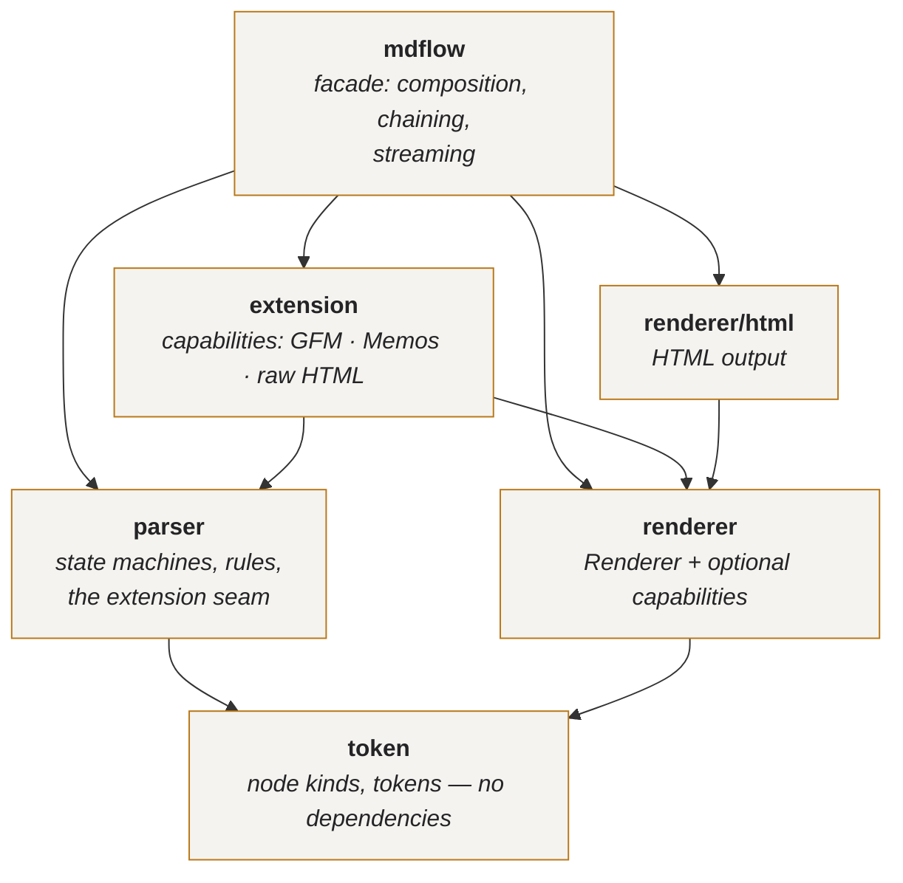
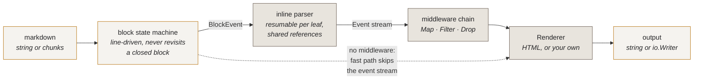

# mdflow

A streaming Markdown parser for Go with a chainable, functional API.

```go
html := mdflow.New().
    Transform(mdflow.ShiftHeadings(1)).
    Transform(mdflow.RewriteLinks(absolutize)).
    Transform(mdflow.Drop(mdflow.IsImage)).
    HTML(src)
```

No syntax tree, no dependencies, one pass over the input, and an incremental
mode built for producers that emit a document a few tokens at a time.

```
go get github.com/Wenrh2004/mdflow                    # core: CommonMark, zero dependencies
go get github.com/Wenrh2004/mdflow/extension/gfm      # or any single extension
go get github.com/Wenrh2004/mdflow/all                # or every bundled flavour
```

Each extension is its own module, so a program links only the syntax it
imports. All modules are versioned in lockstep (`v0.1.0`,
`extension/gfm/v0.1.0`, …); `go.work` wires them together for development, and
`scripts/release.sh` tags them together.

---

## Architecture

`mdflow` is a facade. It owns no syntax and no markup — it wires the layers
below together and adds the chaining and streaming surface.



| Package | Responsibility | Depends on |
| --- | --- | --- |
| `token` | node kinds, `Inline`, `Leaf`, `BlockEvent`, tags | — |
| `parser` | the state machines, the rules, and the extension seam | `token` |
| `renderer` | the `Renderer` interface and its optional capabilities | `token` |
| `renderer/html` | the HTML implementation | `token`, `renderer` |
| `extension` | capabilities: syntax paired with the output it produces | `token`, `parser`, `renderer` |
| `mdflow` | composition, chaining, streaming | all |

Dependencies point strictly downward — verified as a DAG, no cycles. Note what
is *absent*: `extension` does not depend on `renderer/html`. It configures
output through the capability interfaces in `renderer`, so a new output format
is a new `Renderer` and new syntax is a new capability, and neither has to know
the other exists.

`internal/` is reserved for implementation details rather than public parser
types. In particular, the raw-HTML implementation lives there and is exposed
through `extension/rawhtml`; the public `parser` package declares the state
machines and extension seams it promises directly.

### Capabilities

Flavour syntax beyond CommonMark — GFM tables and task lists, math, hashtags,
typography and wiki resources — is an **extension capability**, and a
capability owns *both* halves of its feature. CommonMark raw HTML uses the same
seam so the parser core stays raw-HTML-blind and output behaviour is registered
through renderer capabilities; `mdflow.New` composes it into the default profile
with safe escaping:

```go
type Extension interface {
    Rules(p *parser.RuleSet)      // what syntax exists
    Render(r renderer.Renderer)   // what it emits
}
```

Neither half is meaningful alone: a rule with no rendering parses text into a
node nothing knows how to write. So they are declared side by side —

```go
var strikeTag = token.NewTag("github.com/Wenrh2004/mdflow/extension/strikethrough.strikethrough")

var Strikethrough = extension.Capability{
    Name:   "strikethrough",
    Syntax: func(p *parser.RuleSet) { p.AddInlineRule(strikeRule{}) },
    Output: func(r renderer.Renderer) { extension.Paired(r, strikeTag, "<del>", "</del>") },
}
```

— and `token` never learns the word "strikethrough". Its built-in structural
vocabulary is joined by three open kinds (`Custom`, `CustomLeaf`,
`CustomContainer`), each carrying a tag, so syntax you invent sits on exactly
the footing the bundled flavours do.

`renderer.Renderer` is the floor; hosting custom nodes and deep-copying are
*optional capabilities* (`CustomRegistrar`, `Cloner`, …) in the manner of
`io.ReaderFrom`. The `renderer.RegisterCustom` family reports whether a
registration landed, so a renderer that cannot host a node is a condition you
can observe rather than a branch that quietly skips.

### Construction

```go
import (
    "github.com/Wenrh2004/mdflow"
    "github.com/Wenrh2004/mdflow/all"
    "github.com/Wenrh2004/mdflow/extension/gfm"
    "github.com/Wenrh2004/mdflow/extension/rawhtml"
    "github.com/Wenrh2004/mdflow/parser"
    "github.com/Wenrh2004/mdflow/renderer/html"
)

var commonmark = mdflow.New()             // complete CommonMark 0.31.2, safe HTML

var commonmarkGFM = mdflow.New(           // preserve CommonMark; add GFM
    mdflow.WithExtensions(gfm.GFM),
)

var everything = all.New()                // CommonMark + bundled GFM and Memos

var trusted = mdflow.New(                 // raw HTML verbatim for trusted input
    rawhtml.WithUnsafeHTML(),
)

var configured = mdflow.NewBuilder().     // configured CommonMark + GFM
    Use(gfm.GFM).
    Renderer(html.NewRenderer()).
    With(mdflow.WithHTML5()).
    Build()

var explicit = mdflow.NewWith(            // exactly the named profile
    parser.New(),                         // built-ins; intentionally HTML-blind
    html.NewRenderer(),
    rawhtml.RawHTML,                      // completes CommonMark safely
    gfm.GFM,                              // tables + strikethrough + task lists
)
```

`Builder` is the only wiring path; `New` and its options delegate to it. Options
*record* choices and `Build` applies them once, in a fixed order — rules and
renderer settle, then capabilities, output policies, and renderer tweaks. That
is not a style preference. When options configured as they ran,
`New(WithRenderer(...))` discarded every capability registration made against
the renderer it replaced, and `WithHTML5` landed or did not depending on its
position in the argument list.

### Naming

Node kinds and event types follow the conventions the standard library already
established rather than inventing a `Kind`-prefix scheme:

| | Convention | Precedent | Example |
| --- | --- | --- | --- |
| Node kinds | unprefixed — the package name is the qualifier | `reflect.Kind` → `reflect.Int` | `token.Heading`, `token.Link` |
| Event types | `-Event` suffix | `html.NodeType` → `html.TextNode` | `mdflow.EnterEvent`, `mdflow.TextEvent` |
| Block ops | `-Block` suffix | as above | `token.OpenBlock`, `token.LeafBlock` |
| Extension tags | import path + node name, naming the node not its markup | `gob.Register` type names | `token.NewTag(".../extension/table.cell")` |

`token.KindHeading` would be stutter: the package already says `token`. The
suffix on the event enum is not decoration either — it is what lets `token.Text`
(a node) and `mdflow.TextEvent` (an event) coexist without collision.

Tags name what the author wrote, never how it renders: `strikethrough`, not
`del`. A terminal renderer strikes the run and a JSON renderer emits a type
field, and neither should be handed a vocabulary of HTML element names. The
name is also the tag's identity — the syntax half and the output half of a
capability each ask for it and agree — so it is qualified by the defining
package's import path, and two unrelated extensions cannot collide by both
choosing `table`.

The package is `token` and not `ast` because there is no tree. An `Inline`
carries a `Close` flag instead of children — the representation a syntax tree
would replace, not a step toward one — and `ast.Node` invites a reader to expect
`.Children()`.

The outline entry that `Headings` returns is `mdflow.Heading`, not
`token.Heading`: it is a derived view rather than a parse node, and in `token`
the name belongs to the node kind.

---

## How a document flows through



Block structure is strictly sequential — a line's meaning depends on the
container stack above it. Most closed leaves proceed directly through inline
parsing. If one reaches an unresolved reference, its cursor and the suffix
behind it pause until a later definition resolves it or end of input seals the
definition map. The dashed fast path bypasses the public event stream when no
middleware is installed.

---

## Why it is shaped this way

**A flat event stream instead of an AST.** Parsing emits
`Enter`/`Leave`/`Text`/`Code` events — the pulldown-cmark model. Nothing
allocates a node per construct, nothing walks a tree twice, and a consumer can
stop halfway through a document and the parser stops with it.

**Line-driven and incremental.** The block state machine never revisits a closed
block, so appending input only touches the top of the container stack. A forward
reference retains only the unresolved suffix and resumes its cursor when a
definition arrives; it does not trigger a document prepass or reparse. Feeding
a document in 64-byte chunks therefore remains O(n), where the usual chat-UI
approach (re-parse everything on every chunk) is O(n²).

**Rules, not switches.** Block and inline syntax live in registries
(`ContainerRule`, `LeafRule`, `InlineRule`) and output lives behind `Renderer`.
Adding syntax or an output format is an addition, not a fork.

**Pay for what you use.** A parser with no middleware takes a fast path that
never materialises the event stream at all. The functional layer is free until
you reach for it.

---

## Usage

### One-shot

```go
html := mdflow.HTML("# Hello\n\nSome *markdown*.\n")
```

### Reusable, shareable

A `Parser` is immutable and safe for concurrent use; its scratch state is
pooled. Build one and share it.

```go
var md = mdflow.New()

func handler(w http.ResponseWriter, r *http.Request) {
    md.Render(w, source) // streams straight into the ResponseWriter
}
```

### Chaining

Every chaining method returns a *new* parser, so derived parsers never disturb
the one they came from.

```go
var base = mdflow.New()
var forEmail = base.
    Transform(mdflow.Unwrap(mdflow.IsImage)).
    Transform(mdflow.RewriteLinks(track))
```

| Method | Effect |
| --- | --- |
| `With(opt...)` | derive with construction options (`WithSafeLinks()`, `WithURLPolicy(…)`, …) |
| `WithExtensions(ext...)` | derive with extra syntax/renderer capabilities |
| `Transform(mw...)` | append event middlewares |
| `Map(f)` | rewrite every event |
| `Filter(pred)` / `Reject(pred)` | keep / drop events |
| `Tap(f)` | observe events, pass through |

Built-in middlewares: `ShiftHeadings`, `RewriteLinks`, `MapText`, `Drop`,
`Unwrap`, plus `Compose` to fuse them.

> `Drop` exists separately from `Filter` for a reason: in a flat stream,
> filtering on `IsCodeBlock` would remove the `EnterEvent` and keep the `LeaveEvent`,
> producing unbalanced markup. `Drop` swallows the whole span, nesting included.

### Functional

The event stream is an `iter.Seq[Event]`, so it composes with ordinary Go. The
generic combinators live in `iterx` as free functions, because Go does not allow
type parameters on methods.

```go
links := slices.Collect(iterx.FilterMap(mdflow.Events(src),
    func(e mdflow.Event) (string, bool) {
        return e.Dest, e.Type == mdflow.EnterEvent && e.Node == token.Link
    }))
```

`Event` is declared in `mdflow`, where its only consumers live; the node kinds
and token types it refers to come from `token`, and the sequence combinators
from `iterx`. There are no forwarding aliases between them — one name per type,
and every one of them renders its own methods in `go doc`.

Extension syntax is matched by tag rather than node, since `token` does not
enumerate it. `IsTag`, `IsMath`, `IsRawHTML`, `IsResource` and `IsTable` cover
the bundled capabilities; `Tagged` and `TaggedLeaf` build a predicate for any
other, including one your own capability defines.

`iterx.Map` · `FilterMap` · `Filter` · `Reject` · `TakeWhile` · `Take` ·
`Reduce` · `Each` · `Count` · `Find` · `Compose`

Materialise a sequence with the standard library's `slices.Collect`; `iterx`
does not duplicate it.

Prebuilt folds: `Text(src)` (markup-stripped plain text) and `Headings(src)`
(the outline), each in a single pass with no rendering.

### Streaming

```go
s := md.Stream()
for chunk := range llmTokens {
    io.WriteString(w, s.Feed(chunk)) // HTML that just became final
}
io.WriteString(w, s.Finish())
```

`Provisional()` renders the not-yet-closed tail, so a UI always has something
displayable between chunks. Chunk boundaries never affect the result — a test
asserts byte-identical output for chunk sizes from 1 to 4096.

When the output is itself a writer, `NewWriter` gives the same stream the shape
of `gzip.Writer`: an `io.WriteCloser` that forwards HTML as it becomes final,
with sticky errors.

```go
w := md.NewWriter(resp)   // any io.Writer
io.Copy(w, modelOutput)   // or io.WriteString(w, chunk) per token
w.Close()                 // flushes the tail; does not close resp
```

### Extending

A capability declares its syntax and its output together. This one changes only
output, so it gives no `Syntax` half — it restyles a node the core already parses:

```go
nofollow := extension.Capability{
    Name: "nofollow-links",
    Output: func(r renderer.Renderer) {
        renderer.OverrideNode(r, token.Link, func(w renderer.Writer, n token.Inline) {
            if n.Close {
                w.WriteString("</a>")
                return
            }
            w.WriteString(`<a rel="nofollow" href="` + n.Dest + `">`)
        })
    },
}

md := mdflow.New().WithExtensions(nofollow)
```

No type assertion: `renderer.OverrideNode` goes through the capability
interface and reports whether the renderer took it. `Parser.WithExtensions`
deep-copies the rule set and renderer, so `md` is a new parser and the one it
derived from is untouched.

`strikethrough.Strikethrough` in `extension/strikethrough` is the smallest
complete capability — one inline rule, one tag registration — and `table.Table`
in `extension/table` the largest, pairing two rules with five render targets.
Both live in one value, which is why neither can ship half of itself.

---

## Benchmarks vs gomark

Compared against [`github.com/usememos/gomark`](https://github.com/usememos/gomark)
(`v0.0.0-20251021153759`), the parser behind Memos, on every dimension a
production user feels — not only speed and memory. Everything below is
reproduced by `go test -bench . -benchmem -run 'Conformance|Safety|BinarySize' -v ./bench/...`;
raw output is in [`bench/results.txt`](bench/results.txt).

```
goos: linux  goarch: amd64  cpu: Intel Xeon @ 2.10GHz (4 vCPU)  go1.26.0
```

Both libraries run the **same input** doing the **same job**. The corpus uses
only constructs both parsers support — headings, prose with emphasis / strong /
inline code / links, fenced code, lists, task lists, blockquotes, tables,
hashtags, highlights, strikethrough and inline math — and
`TestOutputsAreComparable` asserts that both outputs contain every construct.

### Throughput and memory

| Workload | mdflow | gomark | Speedup | mdflow allocs | gomark allocs |
| --- | ---: | ---: | ---: | ---: | ---: |
| Markdown → HTML, 3.4 KiB | **80 µs** | 2.45 ms | **30×** | 100 | 24,068 |
| Markdown → HTML, 34 KiB | **823 µs** | 204 ms | **248×** | 955 | 1,772,717 |
| Markdown → HTML, 344 KiB | **8.27 ms** | 14.1 s | **1700×** | 9,512 | 170,772,637 |
| Render into `io.Writer`, 34 KiB | **765 µs** | 223 ms | **291×** | 954 | 1,772,719 |
| Parse structure only, 34 KiB | **418 µs** | 223 ms | **533×** | 650 | 1,772,449 |
| Plain-text extraction, 34 KiB | **844 µs** | 229 ms | **271×** | 974 | 1,778,119 |
| Markup-light prose, 46 KiB | **284 µs** | 254 ms | **893×** | 3 | 1,047,159 |
| Concurrent (4 cores), 34 KiB | **285 µs** | 140 ms | **492×** | 956 | 1,772,723 |

### Every other dimension

| Dimension | mdflow | gomark |
| --- | ---: | ---: |
| CommonMark 0.31.2 examples correct (`TestConformance`) | **652 / 652** | 100 / 652 |
| Streaming a 3.4 KiB answer in 64-byte chunks, whole stream | **96 µs** (incremental) | 55 ms (re-parse) |
| Per-chunk refresh latency, p50 / p99 (`BenchmarkChunkLatency`) | **4.9 µs / 88 µs** | 2.69 ms / 8.47 ms |
| Worst case: 1 000 nested list markers | **0.62 ms** | 23.5 ms |
| Worst case: 1 000 unmatched `[` | **0.07 ms** | 134 ms |
| Worst case: 1 000 unmatched backticks | **0.11 ms** | 457 ms |
| Worst case: 1 000 unmatched `[[` | **0.25 ms** | 2.80 s |
| Worst case: a 1 000-line paragraph | **0.43 ms** | 84.8 ms |
| Ready parser + first render (`BenchmarkConstruct`) | **0.54 µs**, 4 allocs | 2.31 µs, 37 allocs |
| Attacker HTML reaching output (`TestSafety`) | 0 / 5 | 0 / 5 |
| Output bounded by input (fuzzed invariant) | **yes** — reference and table-padding budgets | no |
| Stripped binary size added (`TestBinarySize`) | 464 KiB core · 624 KiB `all` | **328 KiB** |

Binary size is the one row mdflow does not win, and the reason is the first
row: a complete CommonMark implementation carries the HTML entity table and
the Unicode case-folding table the spec requires. See [#17](https://github.com/Wenrh2004/mdflow/issues/17) for what can
still be trimmed.

For reference, against [goldmark](https://github.com/yuin/goldmark) v1.8.6 —
the de-facto fast Go library, same GFM subset, same XHTML output
(`BenchmarkGoldmarkReference`): **9.27 ms vs 16.4 ms** on 200 KiB of mixed
Markdown (1.8×, 7.6× fewer allocations) and **200 µs vs 458 µs** on 46 KiB of
prose (2.3×).

### Where the gap comes from

The margin widens with document size because the two have different complexity
classes. Timing a parse of plain prose at increasing sizes:

| Lines | Bytes | gomark | mdflow |
| ---: | ---: | ---: | ---: |
| 200 | 3.1 KB | 3.85 ms | 20 µs |
| 400 | 6.2 KB | 7.32 ms | 16 µs |
| 800 | 12.4 KB | 28.6 ms | 28 µs |
| 1600 | 24.8 KB | 123 ms | 147 µs |
| 3200 | 49.6 KB | 597 ms | 108 µs |


Doubling the input roughly **quadruples** gomark's time — it is superlinear.
mdflow stays flat per byte. Three concrete causes:

1. **Tokenisation into `[]*Token`.** gomark allocates a heap object per token
   before parsing begins; mdflow scans strings in place and its inline tokens
   are values in one shared backing array.
2. **A syntax tree.** gomark builds `ast.Document` and walks it to render.
   mdflow renders from the event stream as it goes and never builds a tree.
3. **Repeated rescanning.** gomark's block matchers are handed the remaining
   token slice and several scan far ahead. mdflow's state machine looks at one
   line at a time and never revisits a closed block.

The streaming row deserves its own note. gomark has no incremental mode, so a
streaming UI must re-parse on every chunk. The bench module also measures that
same naive strategy *on mdflow* (`mdflow-reparse`: 2.5 ms) to separate the two
effects. Under the identical naive strategy mdflow is **22×** faster than gomark
— that is raw single-pass speed. Switching mdflow from naive to incremental buys
a further **26×** — that is the architecture. Together they give the 572× in the
table. Only the small document is
measured for `gomark-reparse` — on the medium one, re-parsing compounds gomark's
own superlinear cost into minutes per iteration.

### Honest caveats

- **CommonMark conformance is pinned, not inferred.** With trusted-input raw
  HTML output enabled, `TestCommonMarkConformance` matches all **652/652**
  official CommonMark 0.31.2 examples byte for byte. The default profile parses
  the same protocol but intentionally escapes recognised raw HTML; use
  `rawhtml.WithUnsafeHTML` only when verbatim output is appropriate.
- **Feature coverage is now a superset of gomark's**, verified construct by
  construct in `TestFeatureCoverage`: every one of gomark's 31 AST node types has
  an mdflow equivalent. The speed is therefore not bought by parsing less than
  the library it is compared against.
- Markup conventions differ in places — mdflow tags `#foo` as
  `<span class="tag">` where gomark emits a bare `<span>`, and renders inline
  math as `<code class="language-math">` rather than `<code>`. Equivalent
  structure, more useful attributes.
- Single machine, single architecture. Absolute numbers say more about the
  machine than the library; the ratios are what carry over. Reproduce with
  `go test -bench . -benchmem ./bench/...`; raw output is in
  [`bench/results.txt`](bench/results.txt). The complexity-class table above
  was recorded on an Apple M4 Pro.

### Where the two disagree

Probing construct by construct turned up several inputs gomark mishandles and
mdflow does not. Recorded here because "we are faster" means little without
"and at least as correct":

| Input | gomark | mdflow |
| --- | --- | --- |
| `Title\n=====` | `<p>Title<br><mark></mark>=</p>` | `<h1>Title</h1>` |
| `[a](/b "t")` | literal text — no title support | `<a href="/b" title="t">a</a>` |
| `<!-- comment -->` | `<a href="!-- comment --">` | escaped as text |
| `<div>x</div>` | `<a href="div">div</a>x…` | recognised as raw HTML and escaped by default |
| `***bi***` | `<strong><em>` | `<em><strong>` (CommonMark order) |
| `\|a\|b\|` + `\|-\|-\|` | not a table (needs 3+ dashes) | table |

The reverse direction turned up nothing: no probe found a construct gomark
parses that mdflow does not.

---

## Parallelism: across documents, not within one

CommonMark's appendix A notes that block structure is inherently sequential;
only the inline phase, once reference definitions are sealed, could fan out
within a single document. mdflow used to offer that as `Workers(n)`. It has
been removed.

It stopped paying. When the inline scanner got roughly twice as fast, the one
phase that distributes became a small share of the work: on a 4-vCPU Xeon the
fan-out bought 1.02×–1.11× on 128 KiB–2 MiB documents at two to three times the
memory, and on a machine whose cores were already busy it was 18% *slower*
than staying on one core. An option that is rarely worth enabling, and hurts
when a server is loaded, costs more to carry — a second render path, worker
panic plumbing, a reference budget that had to be made order-independent —
than it returns.

Parallelism belongs one level up. A `Parser` is immutable and safe to share,
so a server renders many documents on many cores with no coordination at all:

```go
var md = mdflow.New()

// called from any number of goroutines at once
func handle(w http.ResponseWriter, src string) { md.Render(w, src) }
```

`BenchmarkParallel` measures exactly that — every core rendering its own
document through one shared parser.

---

## Supported syntax

**Default profile (`mdflow.New`)** — complete CommonMark 0.31.2: ATX and setext
headings, paragraphs, thematic breaks, indented and fenced code, blockquotes,
ordered and unordered tight/loose lists with lazy continuation, link reference
definitions, entities and tab expansion; plus emphasis/strong, code spans,
inline and reference links/images, autolinks, raw HTML blocks and inlines, and
hard/soft line breaks. Raw HTML is recognised through an extension capability
and escaped by default.

**Bundled flavours (`all.New`)** — GFM tables, strikethrough and task lists;
Memos math blocks, embeds, inline math, hashtags, highlight, subscript,
superscript, spoilers and wiki-style resources. Task-list markers belong to the
GFM extension and are not part of the core token vocabulary.

### Two deliberate differences from gomark

**Wrappers nest.** `==a **b**==` parses its content recursively in mdflow;
gomark stringifies it and emits the markup literally. Same for `||spoiler||`,
`~sub~` and `^sup^`.

**Raw HTML is escaped by default.** mdflow recognises CommonMark raw HTML blocks
and inlines and reports them as tagged events, but escapes them on output unless
you pass `rawhtml.WithUnsafeHTML()`. gomark passes user-authored tags straight
through, which is an XSS vector for user-generated content. The capability is
the same; the safe default is not.

```go
import "github.com/Wenrh2004/mdflow/extension/rawhtml"

mdflow.HTML("<script>alert(1)</script>")             // escaped
mdflow.New(rawhtml.WithUnsafeHTML()).HTML(trusted)   // verbatim
```

**Safe-by-default covers raw HTML only.** Link and image URI schemes are *not*
filtered by default — `[x](javascript:alert(1))` renders as a live
`href="javascript:..."`, which is spec-compliant (cmark does the same) but a
sink for user-generated content. Because destinations are entity-decoded before
output, `[x](java&#115;cript:alert(1))` reaches the renderer as `javascript:`
too, so a source-level filter downstream would miss it. Pass
`mdflow.WithSafeLinks()` to filter destinations to an `http`/`https`/`mailto`/
`tel`/relative allowlist, evaluated on the decoded destination:

```go
mdflow.New().HTML("[x](javascript:alert(1))")                    // href="javascript:alert(1)"
mdflow.New(mdflow.WithSafeLinks()).HTML("[x](javascript:alert(1))") // href="" — inert
```

**Model output needs one more guard.** A prompt-injected model can emit
``, and a chat UI that renders it leaks
the secret the moment the page loads — no click, and an ordinary `https` URL
that scheme filtering cannot see. `WithURLPolicy` vets every link and image
destination; `html.AllowImageHosts` loads images only from hosts you name,
parsing them the way a browser does (backslashes, missing slashes, userinfo and
ports included). A refused image renders as its alt text and is never fetched:

```go
md := mdflow.New(
    mdflow.WithSafeLinks(),
    mdflow.WithURLPolicy(html.AllowImageHosts("cdn.example.com")),
)
```

**Resource limits are built in.** Output stays linear in input on every
profile: reference expansion is budgeted at `max(input size, 100 KiB)` as in
cmark, GFM tables stop padding short rows after 512 Ki synthesised cells as in
cmark-gfm, and a fuzz invariant asserts the bound. Raw HTML for semi-trusted
content can use GFM's tagfilter, `rawhtml.WithFilteredHTML()`, which keeps
ordinary tags but disarms `<script>`, `<style>`, `<iframe>`, `<textarea>` and
the other page-swallowing tags.

---

## Testing

```
go test ./...                        # unit tests + verified doc examples
go test -race ./...                  # concurrent sharing of a Parser
go test -bench . -benchmem ./bench/...
```

The suite pins the properties the design claims: chunked streaming is
byte-identical to batch parsing at every chunk size; a middleware chain and the
no-middleware fast path produce identical markup; a derived parser never mutates
its parent; and a shared parser is race-free under 64 concurrent goroutines.

## License

MIT
