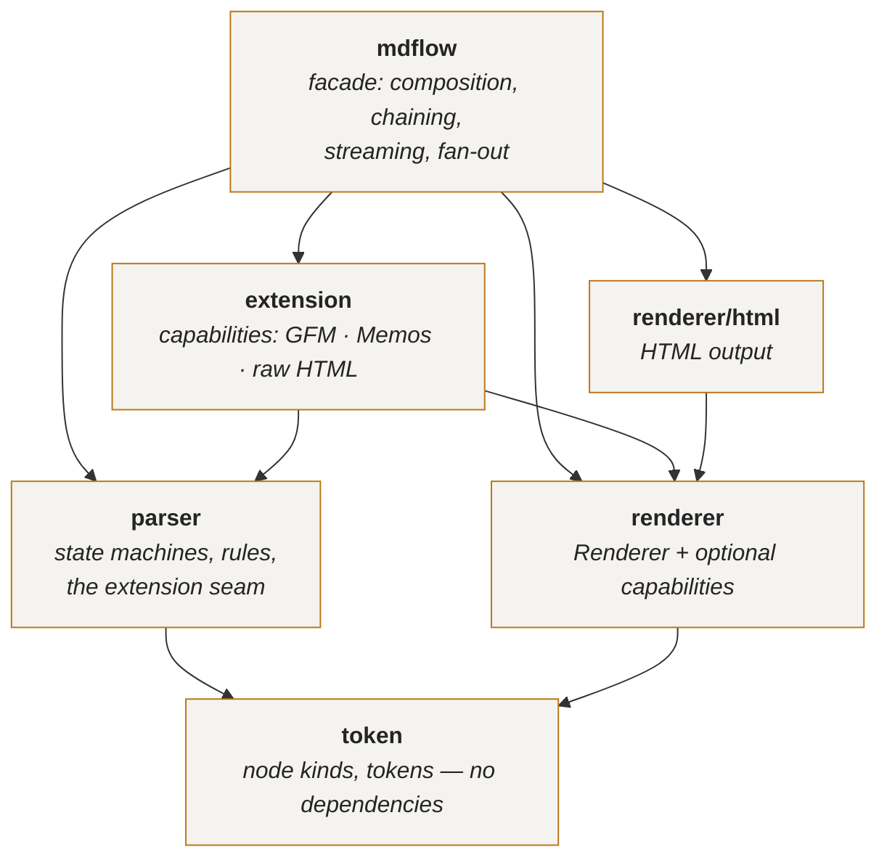
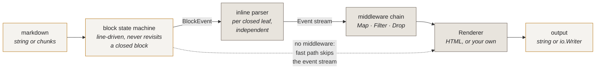

# mdflow

A streaming Markdown parser for Go with a chainable, functional API.

```go
html := mdflow.New().
    Transform(mdflow.ShiftHeadings(1)).
    Transform(mdflow.RewriteLinks(absolutize)).
    Transform(mdflow.Drop(mdflow.IsImage)).
    HTML(src)
```

No syntax tree, no dependencies, one pass over the input, and an incremental
mode built for producers that emit a document a few tokens at a time.

```
go get github.com/Wenrh2004/mdflow
```

---

## Architecture

`mdflow` is a facade. It owns no syntax and no markup — it wires the layers
below together and adds the chaining, streaming and fan-out surface.



| Package | Responsibility | Depends on |
| --- | --- | --- |
| `token` | node kinds, `Inline`, `Leaf`, `BlockEvent`, tags | — |
| `parser` | the state machines, the rules, and the extension seam | `token` |
| `renderer` | the `Renderer` interface and its optional capabilities | `token` |
| `renderer/html` | the HTML implementation | `token`, `renderer` |
| `extension` | capabilities: syntax paired with the output it produces | `token`, `parser`, `renderer` |
| `mdflow` | composition, chaining, streaming, fan-out | all |

Dependencies point strictly downward — verified as a DAG, no cycles. Note what
is *absent*: `extension` does not depend on `renderer/html`. It configures
output through the capability interfaces in `renderer`, so a new output format
is a new `Renderer` and new syntax is a new capability, and neither has to know
the other exists.

There is no `internal/` package. There was one, holding the state machines,
with `parser` re-exporting every one of its exported identifiers as a type
alias. That boundary hid nothing and cost the package its documentation — a
type alias renders no method set, so `go doc parser.Config` printed the alias
and none of `AddLeafRule`, `AddInlineRule` or the rest. What `parser` promises,
it now declares.

### Capabilities

Everything past the CommonMark subset — GFM tables, math, hashtags, typography,
wiki resources, raw HTML — is an **extension capability**, and a capability owns
*both* halves of its feature:

```go
type Extension interface {
    Rules(p *parser.RuleSet)      // what syntax exists
    Render(r renderer.Renderer)   // what it emits
}
```

Neither half is meaningful alone: a rule with no rendering parses text into a
node nothing knows how to write. So they are declared side by side —

```go
var Strikethrough = extension.Capability{
    Name:   "strikethrough",
    Syntax: func(p *parser.RuleSet) { p.AddInlineRule(parser.Strikethrough()) },
    Output: func(r renderer.Renderer) { /* register <del> for the tag */ },
}
```

— and `token` never learns the word "strikethrough". It enumerates CommonMark
plus three open kinds (`Custom`, `CustomLeaf`, `CustomContainer`), each carrying
a tag, so syntax you invent sits on exactly the footing the bundled flavours do.

`renderer.Renderer` is the floor; hosting custom nodes and deep-copying are
*optional capabilities* (`CustomRegistrar`, `Cloner`, …) in the manner of
`io.ReaderFrom`. The `renderer.RegisterCustom` family reports whether a
registration landed, so a renderer that cannot host a node is a condition you
can observe rather than a branch that quietly skips.

### Construction

```go
md := mdflow.New()                        // every capability, batteries in

md := mdflow.NewBuilder().                // configured
    Only(extension.GFM).
    Renderer(html.NewRenderer()).
    With(mdflow.WithHTML5()).
    Build()

md := mdflow.NewWith(                     // exactly what you ask for
    parser.New(),                         // CommonMark subset
    html.NewRenderer(),
    extension.GFM,                        // tables + strikethrough only
)
```

`Builder` is the only wiring path; `New` and its options delegate to it. Options
*record* choices and `Build` applies them once, in a fixed order — rules and
renderer settle, then capabilities, then renderer tweaks. That is not a style
preference. When options configured as they ran, `New(WithRenderer(...))`
discarded every capability registration made against the renderer it replaced,
and `WithHTML5` landed or did not depending on its position in the argument list.

### Naming

Node kinds and event types follow the conventions the standard library already
established rather than inventing a `Kind`-prefix scheme:

| | Convention | Precedent | Example |
| --- | --- | --- | --- |
| Node kinds | unprefixed — the package name is the qualifier | `reflect.Kind` → `reflect.Int` | `token.Heading`, `token.Link` |
| Event types | `-Event` suffix | `html.NodeType` → `html.TextNode` | `mdflow.EnterEvent`, `mdflow.TextEvent` |
| Block ops | `-Block` suffix | as above | `token.OpenBlock`, `token.LeafBlock` |
| Extension tags | `Tag` prefix, naming the node not its markup | — | `token.TagStrikethrough`, `token.TagTable` |

`token.KindHeading` would be stutter: the package already says `token`. The
suffix on the event enum is not decoration either — it is what lets `token.Text`
(a node) and `mdflow.TextEvent` (an event) coexist without collision.

Tags name what the author wrote, never how it renders: `"strikethrough"`, not
`"del"`. A terminal renderer strikes the run and a JSON renderer emits a type
field, and neither should be handed a vocabulary of HTML element names.

The package is `token` and not `ast` because there is no tree. An `Inline`
carries a `Close` flag instead of children — the representation a syntax tree
would replace, not a step toward one — and `ast.Node` invites a reader to expect
`.Children()`.

The outline entry that `Headings` returns is `mdflow.Heading`, not
`token.Heading`: it is a derived view rather than a parse node, and in `token`
the name belongs to the node kind.

---

## How a document flows through



Block structure is strictly sequential — a line's meaning depends on the
container stack above it. Inline parsing of a *closed* leaf depends on nothing
outside that leaf, which is both why the fan-out in `Workers` is possible and
why the dashed fast path can bypass the event stream entirely when no middleware
is installed.

---

## Why it is shaped this way

**A flat event stream instead of an AST.** Parsing emits
`Enter`/`Leave`/`Text`/`Code` events — the pulldown-cmark model. Nothing
allocates a node per construct, nothing walks a tree twice, and a consumer can
stop halfway through a document and the parser stops with it.

**Line-driven and incremental.** The block state machine never revisits a closed
block, so appending input only touches the top of the container stack. Feeding a
document in 64-byte chunks costs the same as parsing it whole — which is why
`Stream` is O(n) where the usual chat-UI approach (re-parse everything on every
chunk) is O(n²).

**Rules, not switches.** Block and inline syntax live in registries
(`ContainerRule`, `LeafRule`, `InlineRule`) and output lives behind `Renderer`.
Adding syntax or an output format is an addition, not a fork.

**Pay for what you use.** A parser with no middleware takes a fast path that
never materialises the event stream at all. The functional layer is free until
you reach for it.

---

## Usage

### One-shot

```go
html := mdflow.HTML("# Hello\n\nSome *markdown*.\n")
```

### Reusable, shareable

A `Parser` is immutable and safe for concurrent use; its scratch state is
pooled. Build one and share it.

```go
var md = mdflow.New()

func handler(w http.ResponseWriter, r *http.Request) {
    md.Render(w, source) // streams straight into the ResponseWriter
}
```

### Chaining

Every chaining method returns a *new* parser, so derived parsers never disturb
the one they came from.

```go
var base = mdflow.New()
var forEmail = base.
    Transform(mdflow.Unwrap(mdflow.IsImage)).
    Transform(mdflow.RewriteLinks(track))
```

| Method | Effect |
| --- | --- |
| `Use(ext...)` | derive with extra syntax/renderer rules |
| `Transform(mw...)` | append event middlewares |
| `Map(f)` | rewrite every event |
| `Filter(pred)` / `Reject(pred)` | keep / drop events |
| `Tap(f)` | observe events, pass through |
| `Workers(n)` | fan the inline phase across n cores (see [below](#parallelism-measured-not-assumed)) |

Built-in middlewares: `ShiftHeadings`, `RewriteLinks`, `MapText`, `Drop`,
`Unwrap`, plus `Compose` to fuse them.

> `Drop` exists separately from `Filter` for a reason: in a flat stream,
> filtering on `IsCodeBlock` would remove the `EnterEvent` and keep the `LeaveEvent`,
> producing unbalanced markup. `Drop` swallows the whole span, nesting included.

### Functional

The event stream is an `iter.Seq[Event]`, so it composes with ordinary Go. The
generic combinators live in `iterx` as free functions, because Go does not allow
type parameters on methods.

```go
links := iterx.Collect(iterx.FilterMap(mdflow.Events(src),
    func(e mdflow.Event) (string, bool) {
        return e.Dest, e.Type == mdflow.EnterEvent && e.Node == token.Link
    }))
```

`Event` is declared in `mdflow`, where its only consumers live; the node kinds
and token types it refers to come from `token`, and the sequence combinators
from `iterx`. There are no forwarding aliases between them — one name per type,
and every one of them renders its own methods in `go doc`.

Extension syntax is matched by tag rather than node, since `token` does not
enumerate it. `IsTag`, `IsMath`, `IsRawHTML`, `IsResource` and `IsTable` cover
the bundled capabilities; `Tagged` and `TaggedLeaf` build a predicate for any
other, including one your own capability defines.

`iterx.Map` · `FilterMap` · `Filter` · `Reject` · `TakeWhile` · `Take` ·
`Reduce` · `Collect` · `Each` · `Count` · `Find` · `Compose`

Prebuilt folds: `Text(src)` (markup-stripped plain text) and `Headings(src)`
(the outline), each in a single pass with no rendering.

### Streaming

```go
s := md.Stream()
for chunk := range llmTokens {
    io.WriteString(w, s.Feed(chunk)) // HTML that just became final
}
io.WriteString(w, s.Close())
```

`Provisional()` renders the not-yet-closed tail, so a UI always has something
displayable between chunks. Chunk boundaries never affect the result — a test
asserts byte-identical output for chunk sizes from 1 to 4096.

### Extending

A capability declares its syntax and its output together. This one changes only
output, so it gives no `Syntax` half — it restyles a node the core already parses:

```go
nofollow := extension.Capability{
    Name: "nofollow-links",
    Output: func(r renderer.Renderer) {
        renderer.OverrideNode(r, token.Link, func(w renderer.Writer, n token.Inline) {
            if n.Close {
                w.WriteString("</a>")
                return
            }
            w.WriteString(`<a rel="nofollow" href="` + n.Dest + `">`)
        })
    },
}

md := mdflow.New().WithExtensions(nofollow)
```

No type assertion: `renderer.OverrideNode` goes through the capability
interface and reports whether the renderer took it. `Parser.WithExtensions`
deep-copies the rule set and renderer, so `md` is a new parser and the one it
derived from is untouched.

`extension.Strikethrough` is the smallest complete capability — one inline rule,
one tag registration — and `extension.Table` the largest, pairing two rules with
five render targets. Both live in one value, which is why neither can ship half
of itself.

---

## Benchmarks vs gomark

Compared against [`github.com/usememos/gomark`](https://github.com/usememos/gomark)
(`v0.0.0-20251021153759`), the parser behind Memos.

Both libraries run the **same input** doing the **same job**. The corpus uses
only constructs both parsers support — headings, prose with emphasis / strong /
inline code / links, fenced code, lists, task lists, blockquotes, tables,
hashtags, highlights, strikethrough and inline math — so the numbers measure
parsing, not one library skipping syntax it does not implement. A test in the
bench module (`TestOutputsAreComparable`) asserts that both outputs actually
contain every construct.

```
goos: darwin  goarch: arm64  cpu: Apple M4 Pro  go1.26
go test -run '^$' -bench . -benchmem ./bench/...
```

| Workload | mdflow | gomark | Speedup | mdflow allocs | gomark allocs |
| --- | ---: | ---: | ---: | ---: | ---: |
| Markdown → HTML, 3.4 KiB | **32.2 µs** | 881 µs | **27×** | 213 | 24,068 |
| Markdown → HTML, 34 KiB | **324 µs** | 78.6 ms | **242×** | 2,104 | 1,772,717 |
| Markdown → HTML, 344 KiB | **3.36 ms** | 6.57 s | **1953×** | 21,027 | 170,772,639 |
| Render into `io.Writer`, 34 KiB | **324 µs** | 82.8 ms | **256×** | 2,103 | 1,772,717 |
| Parse structure only, 34 KiB | **73.9 µs** | 83.3 ms | **1127×** | 250 | 1,772,449 |
| Streaming, 64-byte chunks, 3.4 KiB | **39.2 µs** | 19.9 ms | **507×** | 517 | 489,167 |
| Plain-text extraction, 34 KiB | **323 µs** | 87.9 ms | **272×** | 2,106 | 1,778,118 |
| Markup-light prose, 46 KiB | **76.5 µs** | 88.8 ms | **1160×** | 402 | 1,047,156 |
| Concurrent (14 cores), 34 KiB | **214 µs** | 41.9 ms | **196×** | 2,113 | 1,772,723 |

mdflow is faster on every workload measured, allocates 113×–8122× fewer objects,
and sustains 100–620 MB/s where gomark sustains 0.05–3.8 MB/s.

### Where the gap comes from

The margin widens with document size because the two have different complexity
classes. Timing a parse of plain prose at increasing sizes:

| Lines | Bytes | gomark | mdflow |
| ---: | ---: | ---: | ---: |
| 200 | 3.1 KB | 3.85 ms | 20 µs |
| 400 | 6.2 KB | 7.32 ms | 16 µs |
| 800 | 12.4 KB | 28.6 ms | 28 µs |
| 1600 | 24.8 KB | 123 ms | 147 µs |
| 3200 | 49.6 KB | 597 ms | 108 µs |


Doubling the input roughly **quadruples** gomark's time — it is superlinear.
mdflow stays flat per byte. Three concrete causes:

1. **Tokenisation into `[]*Token`.** gomark allocates a heap object per token
   before parsing begins; mdflow scans strings in place and its inline tokens
   are values in one shared backing array.
2. **A syntax tree.** gomark builds `ast.Document` and walks it to render.
   mdflow renders from the event stream as it goes and never builds a tree.
3. **Repeated rescanning.** gomark's block matchers are handed the remaining
   token slice and several scan far ahead. mdflow's state machine looks at one
   line at a time and never revisits a closed block.

The streaming row deserves its own note. gomark has no incremental mode, so a
streaming UI must re-parse on every chunk. The bench module also measures that
same naive strategy *on mdflow* (`mdflow-reparse`: 566 µs) to separate the two
effects. Under the identical naive strategy mdflow is **19×** faster than gomark
— that is raw single-pass speed. Switching mdflow from naive to incremental buys
a further **18×** — that is the architecture. Together they give the 346× in the
table. Only the small document is
measured for `gomark-reparse` — on the medium one, re-parsing compounds gomark's
own superlinear cost into minutes per iteration.

### Honest caveats

- **mdflow is a CommonMark subset**, not a compliant implementation — see
  [Supported syntax](#supported-syntax). Indented code blocks, reference links,
  raw HTML *blocks* and footnotes are absent, and some of the speed comes from
  doing less. (gomark implements none of those either.) Against the pinned
  CommonMark spec suite (v0.31.2, 652 examples) the core passes **49.2% raw**
  and **57.9% of the supported subset** — the sections it implements, excluding
  the deliberately-absent ones above and source-entity/tab handling. The number
  is measured by `TestCommonMarkConformance`, not asserted here, and carries a
  regression floor so it can only move up.
- **Feature coverage is now a superset of gomark's**, verified construct by
  construct in `TestFeatureCoverage`: every one of gomark's 31 AST node types has
  an mdflow equivalent. The speed is therefore not bought by parsing less than
  the library it is compared against.
- Markup conventions differ in places — mdflow tags `#foo` as
  `<span class="tag">` where gomark emits a bare `<span>`, and renders inline
  math as `<code class="language-math">` rather than `<code>`. Equivalent
  structure, more useful attributes.
- Single machine, single architecture (Apple M4 Pro, arm64). Reproduce with
  `go test -bench . -benchmem ./bench/...`; raw output is in
  [`bench/results.txt`](bench/results.txt).

### Where the two disagree

Probing construct by construct turned up several inputs gomark mishandles and
mdflow does not. Recorded here because "we are faster" means little without
"and at least as correct":

| Input | gomark | mdflow |
| --- | --- | --- |
| `Title\n=====` | `<p>Title<br><mark></mark>=</p>` | `<h1>Title</h1>` |
| `[a](/b "t")` | literal text — no title support | `<a href="/b" title="t">a</a>` |
| `<!-- comment -->` | `<a href="!-- comment --">` | escaped as text |
| `<div>x</div>` | `<a href="div">div</a>x…` | passed through as HTML |
| `***bi***` | `<strong><em>` | `<em><strong>` (CommonMark order) |
| `\|a\|b\|` + `\|-\|-\|` | not a table (needs 3+ dashes) | table |

The reverse direction turned up nothing: no probe found a construct gomark
parses that mdflow does not.

---

## Parallelism: measured, not assumed

CommonMark's appendix A notes that block structure is inherently sequential
while inline parsing of a closed leaf depends on nothing outside that leaf. So
phase two can be distributed. `Workers(n)` does that — and it is off by default,
because it only pays under conditions worth stating precisely.

```go
md := mdflow.New().Workers(0) // 0 = GOMAXPROCS
html := md.HTML(bigDoc)       // byte-identical to the sequential path
```

| Document | Speedup | Memory |
| --- | ---: | ---: |
| 14 KiB | **1.15×** | +5% |
| 43 KiB | **1.04×** | +7% |
| 175 KiB | **1.45×** | +22% |
| 511 KiB | **1.89×** | +17% |
| 2 MiB | **1.98×** | +23% |
| 175 KiB, all cores busy | **1.68×** | +18% |

Apple M4 Pro, 14 cores, dense mixed corpus — one document shape scaled by
section count, so only size varies. Ratios rather than absolute times, because
absolutes say more about the machine that ran them than about the library.

Worker scaling at 511 KiB: 1.47× at 2, 1.72× at 4, 1.87× at 8, 2.02× at 14 —
Amdahl's ceiling, since only the inline phase distributes. Past 4 workers you
are buying very little.

**Granularity is the whole game.** The obvious design — one goroutine per block,
the classic actor fan-out — is *an order of magnitude slower* than staying on one
core: a block's few microseconds of work cannot pay for a goroutine handoff, and
a CPU profile is nothing but `selectgo`, `park_m` and `runqsteal`. This
implementation instead partitions the block-event stream into one large
contiguous range per worker, so a single handoff amortises over thousands of
blocks.

**What it costs.** Fan-out must hold the whole document's block events at once,
where the sequential path streams them and keeps only the top of the container
stack. That is the +5–23% memory above, and it is why this is opt-in. It also
cannot be combined with a middleware chain (a `Middleware` may carry state across
the whole stream), and inputs under 16 KiB fall back to sequential.

> An earlier revision of this code sized the event buffer with a bad heuristic
> and re-grew it several times per document. That alone made fan-out *slower*
> than sequential at every size under 512 KiB and cost 2.7× memory. Pooling the
> buffer across calls is what turned a losing feature into a winning one — worth
> remembering before concluding that an architecture does not pay.

`TestParallelCrossover` asserts the fan-out still gives ≥1.5× on a document four
times the threshold. If a future optimisation shrinks the inline share of the
work, that test fails, and the honest response is to delete `Workers` rather than
keep an option that does nothing.

---

## Supported syntax

**Blocks** — ATX headings, setext headings, paragraphs, fenced code,
blockquotes (nestable), ordered and unordered lists, task lists, thematic
breaks, GFM tables with alignment, `$$` math blocks, `![[embed]]`.

**Inline** — emphasis, strong, inline code, links (with titles), images,
autolinks (`<url>`, `<email>`), strikethrough, hard breaks (both spellings),
backslash escapes, `$math$`, `#hashtags`, `==highlight==`, `~subscript~`,
`^superscript^`, `||spoiler||`, `[[reference]]`, raw HTML tags.

**Not implemented** — indented code blocks, reference-style links, raw HTML
*blocks*, HTML comments, footnotes, lazy continuation, loose-list semantics.
Emphasis flanking is simplified to "adjacent to non-whitespace" rather than the
full CommonMark rule.

These are omissions of scope, not of design: each is a rule you can register
through the public API without forking the package.

### Two deliberate differences from gomark

**Wrappers nest.** `==a **b**==` parses its content recursively in mdflow;
gomark stringifies it and emits the markup literally. Same for `||spoiler||`,
`~sub~` and `^sup^`.

**Raw HTML is escaped by default.** mdflow recognises inline HTML and reports it
as `raw_html`-tagged events, but escapes it on output unless you pass
`WithUnsafeHTML()`. gomark passes user-authored tags straight through, which is
an XSS vector for user-generated content. The capability is the same; the safe
default is not.

```go
mdflow.HTML("<script>alert(1)</script>")            // escaped
mdflow.New(mdflow.WithUnsafeHTML()).HTML(trusted)   // passed through
```

---

## Testing

```
go test ./...                        # unit tests + verified doc examples
go test -race ./...                  # concurrent sharing of a Parser
go test -bench . -benchmem ./bench/...
```

The suite pins the properties the design claims: chunked streaming is
byte-identical to batch parsing at every chunk size; a middleware chain and the
no-middleware fast path produce identical markup; a derived parser never mutates
its parent; and a shared parser is race-free under 64 concurrent goroutines.

## License

MIT
