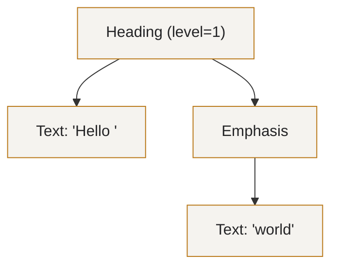
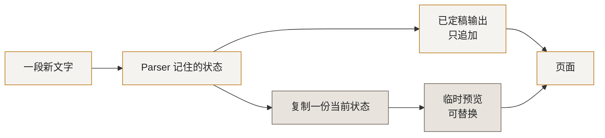
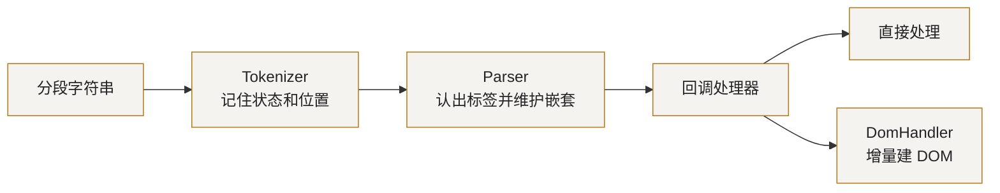
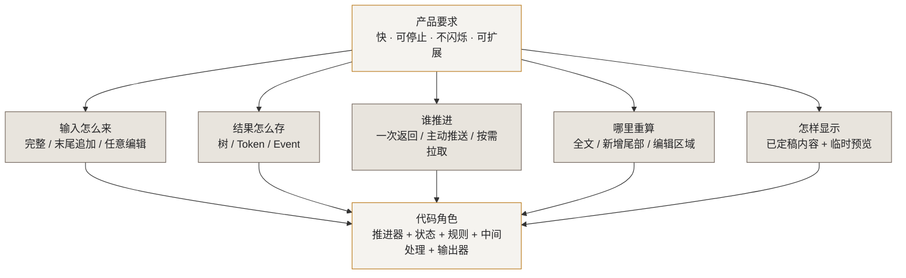

# 从零实现的 MD Parser 到编译原理的演进

> 这不是一篇「mdflow 源码导读」。
>
> 这是一篇**用 Markdown Parser 这个最小可玩的编译器，把编译原理讲明白**的教程。
> Markdown 足够小，可以在一篇文章里看全「读字符、认语法、保存中间结果、修改结果、输出 HTML」；它又足够复杂，
> 能暴露歧义、错误恢复、增量更新和流式上屏这些真实工程问题。
>
> 我们会拿本仓库的 `mdflow`（一个 Go 流式 Markdown 解析器）当**解剖标本**，
> 因为它把这些概念都落成了可以点开核对的真实代码。但主角始终是编译原理本身。
>
> 本文会依次讨论 markdown-it、SAX/htmlparser2、pulldown-cmark 和 mdflow。这个顺序只是为了逐个
> 引出设计问题，不代表它们按时间先后彼此取代；事实上，SAX 比 markdown-it 更早。
>
> 读完你应该能回答五个问题：AST 到底是什么；批量、push、pull、增量有何区别；
> LLM 流为什么难；一个 `for` 循环如何长成可扩展 Parser；性能优化应该落在哪一层。

---

## 一、基础知识：经典编译器怎样把源码变成目标程序

### 1.1 经典教材从一个“翻译任务”讲起

经典教材通常从一个翻译任务开始：**读入一种语言写成的源程序，输出另一种语言的目标程序，
同时保持程序原本的含义，并报告无法接受的错误。**

目标程序不一定是机器码，也可能是字节码或另一种高级语言。TypeScript 编译成 JavaScript 就是例子。
Markdown 转 HTML 不是传统意义上的完整编译器，但也经历“读懂结构—保存结果—变换—输出”的过程，
所以很适合作为缩小版练习。

假设有一门很小的语言，`price` 和 `total` 都是已经声明的普通整数。现在看一行源代码：

```text
total = price * 2 + 0
```

经典编译流程会依次回答六个问题：

| 步骤 | 要回答的问题 | 这个例子会得到什么 |
| --- | --- | --- |
| 1. 词法分析 | 这串字符可以切成哪些有意义的小块？ | 名字 `total`、赋值号、名字 `price`、乘号、数字 `2`、加号、数字 `0` |
| 2. 语法分析 | 这些小块怎样嵌套？谁先计算？ | 先算 `price * 2`，再加 `0`，最后赋给 `total` |
| 3. 语义分析 | 名字指向什么？类型和用法是否合法？ | 检查 `price`、`total` 已声明，而且可以参与数值运算 |
| 4. 转换表示 | 是否要把语法树换成更适合后续分析的格式？ | `t1 = price * 2; t2 = t1 + 0; total = t2` |
| 5. 分析与优化 | 能否保持含义不变，但少做一些工作？ | 删除无意义的 `+ 0`，直接令 `total = t1` |
| 6. 代码生成 | 怎样变成目标平台认识的程序？ | 选择加载、乘法、存储等目标指令 |

这六步首先代表六类必须回答的问题，不要求实现成六个独立模块。一个阶段可以生成新的表示，也可以
继续使用并补充已有表示；真实编译器还可能交错或合并其中若干步骤。


经典架构图通常还会画出两个贯穿各阶段的公共能力。**符号表**记录名字、声明、类型和作用域；
**错误诊断**则在不同阶段报告不同问题，例如非法字符、缺少括号、名字未声明或类型不匹配。
它们不是排在线末尾的第七、八步，而是被多个步骤共同使用。

词法分析只负责把字符切成带类别的小块，例如名字、数字和运算符。语法分析再根据优先级和文法规则，
把这些小块组织成树。语义分析继续检查“语法上能写”的程序，在当前语言里是否真的有意义。

语法和语义阶段常使用 AST 等接近源码的中间表示。随后，编译器还可以把它转换成另一种更适合
追踪“一个值在哪里产生、在哪里使用”的 IR，在这种表示上删除无用工作，最后再适配具体目标。
AST 和后续表示都可以是 IR，只是服务于不同阶段。

经典教材还会把整条流程粗分为“分析源程序”和“根据分析结果合成目标程序”。现代工程中也常说：

- **前端**：处理源语言相关的问题，例如扫描、语法、名字绑定和类型检查。
- **优化器**：在一种或多种 IR 上分析和改写程序。
- **后端**：处理目标平台相关的问题，例如指令选择、寄存器分配和最终输出。

这些只是方便交流的分组，边界并不统一。本文后面会直接说“语法分析”“IR 优化”或“代码生成”，
而不是再造一个看不出职责的笼统名称。

LLVM、TypeScript 与 Markdown 恰好展示了三种不同重心：

| 系统 | 怎样读懂输入 | 读懂之后还做什么 | 最后输出什么 |
| --- | --- | --- | --- |
| Clang/LLVM | Clang 把 C/C++ 读成 AST，再转成 LLVM IR | 在 LLVM IR 上分析和优化 | 机器码，或交给即时编译器（JIT）直接运行 |
| TypeScript | Parser 建 AST，Binder 记录名字指向什么 | TypeChecker 检查类型，Transformer 改写语法树 | JS、`.d.ts` 和源码映射 |
| Markdown | 认出标题、段落、列表等结构 | 插件处理、链接改写、安全策略、格式变换 | HTML、纯文本或其他格式 |

[LLVM Kaleidoscope 教程](https://llvm.org/docs/tutorial/MyFirstLanguageFrontend/) 从字符扫描、语法解析、
AST 一直讲到 LLVM IR；[LLVM LangRef](https://llvm.org/docs/LangRef.html) 则说明 LLVM IR 是一种
带类型、适合分析和优化的代码表示，并不是 AST。

[TypeScript Compiler Notes](https://github.com/microsoft/TypeScript-Compiler-Notes) 展示了真实流程：先解析成
AST，再记录每个名字对应的声明，随后检查类型，最后输出 JavaScript。也就是说，语法写对只是第一步，
编译器还要判断 `user.name` 中的 `user` 是谁、有没有 `name` 这个属性。

Markdown 没有类型检查，但也要决定怎样保存标题、列表等结构，怎样修改这些结构，以及怎样让同一份
解析结果输出成 HTML 或纯文本。它是一个缩小的练习场，不是完整编译器的逐项复刻。

### 1.2 什么是 AST：语法分析后常用的结构化表示

在刚才的经典流程中，语法分析需要留下一个结构化结果，AST 是最常见的选择之一。它把“先乘、
后加、最后赋值”保存成层级结构，让后续步骤不必反复研究原始字符和括号。

```text
Assign
├── Name(total)
└── Add
    ├── Multiply
    │   ├── Name(price)
    │   └── Number(2)
    └── Number(0)
```

**AST（Abstract Syntax Tree，抽象语法树）**用节点和父子关系表示后续阶段关心的结构。它通常
省略不必单独保存的表面语法。例如括号可能改变运算顺序，但这种作用已经体现在树的层级中，
因此括号本身不一定成为节点。

同一种表示方法放到 Markdown 中，`# Hello *world*` 可以抽象成：



几个词的边界如下：

| 名称 | 重点 | 典型用途 |
| --- | --- | --- |
| Token | 加过分类标签的一小段输入，如“数字 42” | 把字符扫描结果交给语法解析 |
| CST / Parse Tree | 尽量保留括号、标点等原文细节的树 | 格式化、源码重写、IDE |
| AST | 主要保留下游关心的结构和层级关系 | 检查、解释、变换 |
| Event | 把树按顺序摊开，例如 `开始标题/文字/结束标题` | 逐条消费、低内存遍历 |
| IR | 编译器在处理阶段之间使用的内部表示；AST、字节码、token 或事件都可能承担这个角色 | 在阶段之间传递和处理结果 |

Token 的含义要看所处阶段。Lexer 的 Token 通常是标识符、数字和标点；markdown-it 的 Token 已经
包含标题、段落等结构信息。它们名字相同，但不是同一层次的数据。

因此，「Parser 的输出就是 AST」并不准确。Parser 可以输出保留原文细节的树、token 数组或一串事件，
也可以认出一个结构就立即交给输出器。**IR 不是某一种固定结构，只是上下两个步骤之间的数据约定。**

### 1.3 Parser 怎样往前走：状态、当前位置和规则选择

Lexer 的工作是从字符中认出有意义的小片段。许多 Lexer 都能用**有限状态自动机**解释。其中，
DFA（确定性有限自动机）可以理解为一张固定规则表：

> **一个 DFA = 一组状态 + 一张「当前状态 + 当前输入字符 → 下一个状态」的转移表。**
> 输入一个字符，状态机根据「当前状态 + 当前字符」选择唯一的下一状态。

工程代码常把它写成「循环向前读，再根据当前字符选择候选规则」。这个“选择候选规则”就叫分派，
可以用 `switch`、查表或规则数组实现。`for + switch` 只是便于理解的最小模型，不是所有 Parser 的定义。

`mdflow` 的行内扫描把“向前移动”和“选择候选规则”写得很直观
（[parser/inline.go](../parser/inline.go)，只截主循环）：

```go
	for s.pos < len(src) {                      // 按字节向前扫描
		matched := false
		for _, r := range p.rules[src[s.pos]] { // 根据当前字节查候选规则
			if r.Match(s) {
				matched = true
				break
			}
		}
		if !matched {
			s.AddByte(src[s.pos])
			s.pos++
		}
	}
```

这里的表是 `当前字节 → 可能匹配的行内规则`。例如看到反引号才尝试代码规则。所有规则都失败时，
兜底分支会把当前字符当普通文本，并至少向前移动一个字节，保证循环不会卡死。

要注意：这段实现**不是纯 DFA**。链接规则会继续寻找 `](`，强调语法还要在第二轮配对 `*`、`_`
等定界符，规则也可能递归解析一段子串。主循环像状态机，但复杂语法由各条规则补充，不能仅凭
“游标一直向前”就断言整个算法一定是线性的。

`s.pos` 在一次行内解析中只增不减，这能减少重复扫描。但流式输出还要遵守另一条规则：
**只有不会再被后文改变的结构，才能告诉下游“它已经定稿”。** Parser 可以向前多看几个字符，
也可以重算尚未定稿的尾部，但不应撤回已经对外确认的结果。

### 1.4 怎样认出嵌套结构：文法规则、栈和两轮处理

语法分析要回答“这些小片段能不能组成标题、列表或表达式”。教材常用**上下文无关文法**
（Context-Free Grammar，CFG）描述允许出现的结构。例如：

```
document  → block*
block     → heading | paragraph | list | blockquote
list      → listItem+
listItem  → block*        ← 注意这里递归了:列表项里又能放块
```

一种经典实现叫**递归下降**：为“列表”“列表项”“块”等每类结构各写一个函数。
`parseList` 调用 `parseListItem`，后者再调用 `parseBlock`。文法里一层套一层，代码就一层层调用。

Markdown 的难点不在于给它写几条文法展开规则（教材称“产生式”），而在于规范还包含大量
上下文条件和“多种解释中选哪一种”的规则。
下面两类现象说明了「只写一小份 CFG」不足以直接得到兼容实现：

1. **词法与语法上下文交织**：`-` 是否开启列表，取决于缩进、行位置、容器前缀和后续字符；
   同一字符不能先脱离上下文统一分类，再交给一个简单 Parser。
2. **同一段文字可能有多种解释**：`***foo***` 到底是「加粗的斜体」还是「斜体的加粗」？
   CommonMark 会检查星号两侧的字符、连续星号数量和配对优先级，选出统一答案。

这些工程现象本身不足以证明 CommonMark 在形式语言意义上「不是上下文无关语言」。本文不做
这个更强的数学断言，只强调：规范兼容实现不能靠几条教科书式产生式直接完成。

[CommonMark 规范附录 A](https://spec.commonmark.org/0.31.2/#appendix-a-parsing-strategy)
给出的参考策略分成两个阶段；[parser/block.go](../parser/block.go) 采用了相同的大方向：

```go
// 每输入一行，依次做三件事（对应 CommonMark 附录 A 的第一阶段）：
//
//	1. matchPrefix    检查已有容器能否继续；不能继续的立即关闭
//	2. open           尝试打开新的引用、列表等容器
//	3. classify       判断剩余内容是什么；都不匹配时按段落处理
```

- **第一轮先认大块**：逐行判断标题、段落、列表等，并用一个数组形式的栈记录当前嵌套在
  哪些引用或列表中。代码自己维护这个栈，所以也叫“显式栈”。
- **第二轮再认行内样式**：扫描块内文字，配对 `*`、反引号和链接括号，决定强调、代码和链接。

这样分两轮还有一个性能价值：块结构必须按行依次判断，但已经闭合的标题、段落等叶子块，可以各自
处理内部文字。后文讨论什么时候输出、怎样并行，都建立在这条边界上。

### 1.5 树不是批处理的同义词

「树必须完整才能合法」是一个常见但错误的推论。Parser 完全可以用 `ERROR`、`MissingToken`
或开放节点表示不完整输入；IDE 中的语法树每天都在处理只写到一半的程序。

[Tree-sitter](https://tree-sitter.github.io/tree-sitter/) 更直接地证明：树可以做编辑增量解析。
调用方描述 edit，Parser 复用旧树中未变化的子树，再生成一棵包含错误节点的新树。

树在 LLM 上屏场景中的难点不是「不能增量」，而是**旧节点可能被重新解释**。例如当前尾部的
`*wor` 先是文本，后续 `*` 到达后又可能成为强调。若 UI 已把前一个判断当成永久结果，就需要
撤销 DOM；闪烁和重复工作来自错误的提交策略，而不是树这一数据结构本身。

因此，后文不再要求“收到任意一截文字都能得到完整结构”，而只区分两部分：

- **已定稿部分（stable prefix）**：后续文字不会改变它，可以直接追加到页面，不再撤销。
- **待定尾部（unstable tail）**：后续文字仍可能改变它，可以临时预览，也可以重新解析。

这组边界既能用树实现，也能用事件实现。事件适合按顺序处理，通常少保存一些对象；树适合跳到任意
节点、局部编辑和查询层级。解析结果该怎样保存，取决于后续要做什么，没有永远更好的答案。

---

## 二、为什么 LLM 的流式文本更难处理

### 2.1 先改变一个前提：输入不再一次全部到齐

第一章沿用了经典教材最常见的起点：编译器面对一份有限的源程序，再依次扫描、解析、分析和输出。
到了聊天界面里，LLM 的回答还在生成，Parser 面对的是一份不断增长的文本。

这时，Parser 不只要“读懂语法”，还要回答四个工程问题：

- 哪些旧输出已经可以永久显示？
- 尚未闭合的 Markdown 尾部暂时显示成什么？
- 输入恰好切在 UTF-8 字符、反引号或链接中间时，最终结果是否仍一致？
- 下游处理变慢或主动停止时，上游解析能不能立即停下？

比较不同 Parser 时，也要把四件事分开看：

| 问题 | 常见选择 | 它真正决定什么 |
| --- | --- | --- |
| 输入怎样交给 Parser | 完整字符串 / 逐段追加 / 任意位置编辑 | Parser 能否接着上次继续工作 |
| 解析结果怎样保存 | 树 / Token 数组 / 事件序列 | 后续代码怎样读取、修改和定位原文 |
| 谁控制处理节奏 | Parser 主动回调 / 调用方主动取下一条 | 谁决定何时产生下一个结果 |
| 文本变化后怎么算 | 全部重算 / 只算新增部分 / 只算编辑区域 | 旧结果能复用多少 |

这四件事可以自由组合。树也能增量更新；事件接口也可能要求先给完整输入。调用方能逐条取结果，
也不代表 Parser 能接收下一批网络数据。先拆开问题，才不会把“逐条输出”误当成“逐段解析”。


下面先比较文件、网络与 LLM 输入为什么不同，再讨论页面怎样稳定更新、怎样避免重复解析，以及一套
流式 Parser 至少应该守住哪些规则。

### 2.2 文件、网络和 LLM 虽然都分批到达，区别却很大

三种输入都可能分块到达，但不确定性来源不同：

| 场景 | 数据产生方式 | 完整性信号 | 主要不确定性 |
| --- | --- | --- | --- |
| 文件读取 | 数据通常已经存在，只是分批读取 | 读到文件结尾 | 数据块边界、字符解码、读取失败 |
| 网络读取 | 可能传输已有对象，也可能边产生边传输 | 协议结束帧、已知长度或断连 | 分片、重试、截断、上游是否完成 |
| LLM 文本 | 后文还没有生成 | 模型结束原因、结束事件或取消 | 速度、长度、内容和 Markdown 解释都不确定 |

网络流不保证整篇文档事先存在，更不保证语法完整。文件读取也可能恰好切开一个 UTF-8 字符。
传输层和字符解码器应先把字节拼成合法字符串，再把一段段字符串交给 Markdown Parser。

工程接口常把 LLM 输出称作 “token stream”，但客户端通常拿到的是一小段新增文字。模型切 token
的边界、UTF-8 字符边界、JavaScript 字符串边界和 Markdown 语法边界并不是同一回事。

CommonMark 还有一个反直觉事实：任意字符序列都可作为文档。`**abc` 并非「非法 Markdown」，
最终可能只是普通文本；真正不确定的是，追加内容会不会把当前字面量重新解释成强调、链接或围栏。

### 2.3 页面要既快又不闪，必须区分“定稿”和“临时预览”

考虑当前只收到 `**加粗`。UI 有三种朴素策略：立即当文本、立即当 `<strong>`、等待闭合。
前两种都可能被后文推翻，第三种又会让用户迟迟看不到文字。真正缺少的不是更聪明的猜测，
而是把“已经定稿的内容”和“仍可替换的预览”分开。

更稳健的协议把输出拆成两部分：

- **已定稿输出（Committed）**：含义已经稳定，页面可以永久保留，以后只在后面追加。
- **临时预览（Provisional）**：末尾尚未闭合，但先生成一个可看的版本；下批文字到达后可以整体替换。



Parser 不必费力找出“理论上最多能定稿到哪里”。保守地等一个段落或块结束后再定稿，会稍晚一点，
但页面更新和测试都简单得多。这是在显示速度与实现复杂度之间做选择。

### 2.4 为什么每次重算全文会越来越慢

若每次收到固定大小 `c` 的 chunk，都把累计前缀重新交给批量 Parser，第 `i` 次处理约 `i·c`
个字符。总工作量是：

```text
c + 2c + 3c + ... + kc = c·k(k+1)/2
```

当总长度 `n = k·c` 且 `c` 近似常数时，总量是 O(n²)。更一般地，成本是「所有历史前缀长度之和」。
chunk 数很少或文档很短时，全量重解析完全可能是更简单、更合算的方案。

O(n²) 不是 AST 或 markdown-it 天生的问题。它来自“每来一段文字，就把此前全部文字重新解析一遍”。
用树的 Tree-sitter 可以只重算编辑区域；事件式 Parser 如果每次从头创建，也照样会重复工作。

### 2.5 一套能用于 LLM 上屏的 Parser，至少要守住六条规则

这里的“规则”是可以直接写成测试或接口约定的要求：

1. **怎么切都一样**：无论输入被切成多少段，结束后的结果都应与一次性解析相同。
2. **定稿后不撤回**：已经交给页面永久显示的新增内容，以后不能再修改。
3. **临时工作有上限**：只重算待定尾部，并限制它的长度、嵌套深度或处理时间。
4. **结束方式说清楚**：正常结束、用户取消和意外截断，分别怎样收尾都要有明确约定。
5. **下游停止，上游也停**：消费者不再需要结果时，Parser 不应继续扫描和分配内存。
6. **模型输出不可信**：Markdown 解析不等于安全过滤；危险链接和 HTML 仍需单独检查、清洗。

这六条比「是不是流式 Parser」更适合作为验收标准。下一节用 markdown-it、SAX/htmlparser2、
pulldown-cmark、Tree-sitter 和 mdflow 分别定位这些能力。

---

## 三、几个 Parser 的区别，不是一条“旧技术升级成新技术”的路线

### 3.1 markdown-it：一次拿到完整文本，一次产出完整 Token 数组

先纠正分享大纲里最容易传播的误解：[markdown-it](https://github.com/markdown-it/markdown-it)
并不是「传统 AST Parser」的代表。它的官方
[架构说明](https://github.com/markdown-it/markdown-it/blob/master/docs/architecture.md)
明确说自己不使用传统 AST，而使用一组更贴近渲染过程的 Token。

调用 `md.parse(src, env)` 时，markdown-it 会先认出段落、标题等块，生成顶层 `Token[]`；再解析
每个块内的强调、链接等内容，放进 `children`。随后链接识别、文字替换和排版规则继续修改 Token，
最后输出器遍历完整数组。

Token 用 `nesting = 1/0/-1` 表示 open/self/close，用 `level` 表示嵌套层级，还保存 `map`、
`markup`、`info` 等原文信息。简单说，它是一张按顺序排列、用开闭标记表达嵌套的结构清单。

```text
heading_open(nesting=1, level=0)
inline(nesting=0, children=[text, em_open, text, em_close])
heading_close(nesting=-1, level=0)
```

markdown-it 真正值得学习的是 `Ruler`。它就是一份有名字、有顺序、可以启停的规则表；插件能在
指定规则前后插入新规则。输出器也会按 Token 类型选择处理函数，`mdflow.RuleSet` 沿用了这种思路。

它的公开入口接收完整字符串并返回完整 tokens/HTML，没有跨调用续用的 `feed(chunk)` 状态。
若聊天界面每收到一小段文字都重新渲染累计全文，才会出现 2.4 节的重复工作。这是调用方式造成的，
不能归咎于 Token 数组，也不能说 markdown-it 在所有场景下都是 O(n²)。

### 3.2 SAX 与 htmlparser2：Parser 主动把结果推给你

SAX 解析 XML 时，会主动调用应用提供的 `startElement`、`characters`、`endElement` 等函数。
这种“生产者主动调用消费者”的方式叫 **push（推送）**，这些被调用的函数叫回调（callback）。

[SAX2 XMLReader 文档](https://docs.oracle.com/en/java/javase/11/docs/api/java.xml/org/xml/sax/XMLReader.html)
说明回调是同步的，Parser 会等待 Handler 返回。Handler 也可以抛出 `SAXException` 中止解析。

因此，说“SAX 无法提前结束、完全不能限速”并不准确。应用可以抛出异常中止，也能在同步回调里
暂时阻塞 Parser。它缺少的是一套统一、方便恢复的“需要下一条时再取”的接口。

SAX 规定的是“怎样把结果交给应用”，不规定应用怎样保存结果。应用可以立即处理事件、记成日志，
也可以一边收到事件一边建立 DOM 树。因此，“结果长什么样、是否保存完整结果、谁推进”是三件事。

[htmlparser2](https://github.com/fb55/htmlparser2) 把这套思想落在 JavaScript/TypeScript：

```js
const parser = new Parser(handler)
parser.write(firstChunk)
parser.write(nextChunk)
parser.end()
```

Tokenizer 会记住上次处理到哪个状态和哪个位置，所以标签或属性被切在两段输入之间也能继续。
Parser 再把这些低层位置变成“开始标签、属性、文本”等回调。`WritableStream` 还会先拼好被切开的
UTF-8 字符，避免把半个字符交给 Tokenizer。

同一个 Parser 可以接不同处理器：业务回调可以收到一条处理一条，不保存完整 DOM；`DomHandler`
则会边解析边建树，最终内存仍随文档变大。`pause()` 能暂停 Parser，但如果网络层还在继续塞数据，
待处理队列仍会增长。因此“下游变慢时让上游也减速”的背压，必须贯穿整条数据链。

htmlparser2 的价值不只是「像 SAX」。它同时展示了三层分工：



### 3.3 pulldown-cmark：你主动取下一条结果，但仍要先给完整文本

Rust 的 [pulldown-cmark](https://github.com/pulldown-cmark/pulldown-cmark) 把公共接口设计成
`Iterator<Item = Event<'input>>`。调用方通过 `next()` 主动索取下一条结果，这叫 **pull（拉取）**。
它也可以随时停止，或用 `map`、`filter_map` 修改事件。

```rust
for event in Parser::new(markdown) {
    match event { /* ... */ }
}
```

但 `Parser::new(markdown)` 接收的是完整 `&str`，没有 `feed(chunk)`。创建 Parser 时，它已经扫描
完整文本，建立块级树和链接引用表；调用方逐条取事件时，它再遍历这棵树，并按需解析块内文字。
所以它是“内部用树保存块，外部逐条拉取事件”，并不是完全没有树。

[Event API](https://docs.rs/pulldown-cmark/latest/pulldown_cmark/enum.Event.html) 保证完整遍历时
`Start/End` 成对，但取到一半时当然可能只见 `Start`、还没见 `End`。`into_offset_iter()` 还会告诉
调用方每条事件来自原文的哪段字节，便于错误定位或把输出映射回源码。

提前 `break` 可以省掉后续事件遍历和部分块内解析，但创建 Parser 时的整篇块扫描已经发生。
新文字也不能追加到原 Parser；拿累计全文再创建一个 Parser，仍然是在从头解析。

push 与 pull 的准确对比如下：

| 问题 | push：Parser 主动推送 | pull：调用方主动索取 |
| --- | --- | --- |
| 谁触发下一个输出事件 | Parser | 消费者调用 `next()` |
| 怎样停止 | 借助异常、暂停或外围取消 | `break` 或丢弃 iterator |
| 怎样串联处理 | Handler/filter 链 | Iterator 组合器 |
| 能否需要时再取下一条 | 取决于暂停协议 | 可以 |
| 能否分段追加输入 | htmlparser2 支持；SAX 取决于具体接口 | pulldown-cmark 不支持 |
| 能否让上游网络减速 | 需要额外连接 stream 协议 | 不会自动做到；输入早已在内存中 |

区别只需一句话：push 是 Parser 决定何时把下一条结果交给你；pull 是你调用 `next()` 决定何时
取下一条。`next()` 可以由普通状态机实现，不要求协程。

### 3.4 mdflow：逐条取结果和逐段追加输入，是两个不同接口

`mdflow` 同时提供两种能力，但它们位于不同入口：

- [events.go](../events.go) 的 `Events(src string)` 接收完整字符串，返回 Go `iter.Seq[Event]`。
  调用方用 `for range` 遍历并可随时停止；底层仍是 Parser 调用 `yield(event)` 交付事件，
  并不是 pulldown-cmark 那种显式 `next()`。
- [stream.go](../stream.go) 的 `Stream.Feed(chunk)` 跨调用保存 `BlockState` 与半行 `pending`，
  返回刚刚定稿的新增 HTML；`Provisional()` 则生成当前待定尾部的临时预览。

`Events` 会在事件边界停下。为了确定当前事件，Parser 可能已经看完当前行或当前块；因此它能保证
“不再继续做后面的工作”，但不能保证“一个多余字节都没看”。

`Stream` 才用于 LLM 的追加输入。每段输入的末尾不等于文档结束；如果最后一行还没收完，就先保存，
等下一段继续。真正结束时，`Close()` 再处理最后一行并关闭仍然开放的结构。

### 3.5 Tree-sitter：树也可以做增量

[Tree-sitter](https://github.com/tree-sitter/tree-sitter) 构造保留语法细节的树（CST），并通过
`tree.edit(...) + parser.parse(newInput, oldTree)` 复用未变化子树。它面向任意位置编辑，而不是只
处理尾部追加，是「树 + 编辑增量」的代表。

它与 mdflow 解决的问题不同：编辑器要跳到任意节点、表示错误、修改任意位置；LLM 输出通常只在
末尾追加，更关心哪些新增内容已经定稿、哪些尾部只是预览。前者适合保留树，后者可按顺序处理事件。

### 3.6 不要把不同选择硬排成一条升级路线

把这些实现放进同一张表会更清楚：

| 实现/接口 | 输入 | 交给调用方什么 | 谁推进 | 能否接着上次继续 | 内部主要记住什么 |
| --- | --- | --- | --- | --- | --- |
| markdown-it | 完整字符串 | 完整 Token 数组或 HTML | 一次调用 | 否 | 完整 Token 数组 |
| SAX | Reader 提供的输入 | 一次次回调 | Parser 主动推送 | 取决于具体 Reader | Parser 与处理器的状态 |
| htmlparser2 `Parser` | `write/end` 分段输入 | 一次次回调 | Parser 主动推送 | **可以追加** | 扫描状态与开放标签栈 |
| pulldown-cmark | 完整 `&str` | `Iterator<Event>` | 调用方调用 `next()` | 否 | 块级树与当前遍历位置 |
| Tree-sitter | 新输入 + 旧树 | 保留语法细节的树 | 一次调用 | **可以编辑任意位置** | 可复用的旧子树 |
| mdflow `Events` | 完整字符串 | `iter.Seq<Event>` | `range` 开始、`yield` 交付 | 否 | 按需块/行内状态 |
| mdflow `Stream` | `Feed/Close` 分段输入 | 已定稿新增内容 + 临时预览 | 调用方喂入 | **追加增量** | 块栈 + 开放块 + 半行 |

这里所谓“演进”，不是旧库依次被新库淘汰，而是工程需求逐渐逼我们把几个问题分开选择：输入能否
追加、结果怎样保存、谁推进处理、旧工作怎样复用。下一节把这些选择落成一个最小实现。

---

## 四、如何实现一套 MD Parser

先不用 Parser Generator。一个最小 Parser 只要把五个角色分清：

- **Driver（推进器）**：不断读取输入，决定下一步调用哪条规则。
- **State（状态）**：记住当前读到哪里、哪些结构还没有关闭。
- **Node/Event（结果协议）**：统一描述“认出了什么”。
- **Handler（语法规则）**：判断当前位置是不是标题、链接、强调等结构。
- **Renderer（输出器）**：把解析结果变成 HTML、纯文本或其他格式。

面向 LLM 时，还要区分定稿内容与临时预览；要支持插件，则让中间处理步骤可以按顺序组合。


### 4.1 语法解析是什么：一个循环，但每一轮都必须向前

“一个 `for` 循环 + `switch`”是很好的起点。说完整一点，就是：

```text
只要还没读到结尾：
    根据当前状态和字符，找出可能匹配的规则
    按优先级逐条尝试
    如果匹配成功，必须读取一些输入或改变状态
    如果全部失败，把当前字符当普通文本并向前一步
```

`mdflow` 行内主循环用当前 byte 直接索引规则数组：

```go
for s.pos < len(src) {
	matched := false
	for _, rule := range p.rules[src[s.pos]] {
		if rule.Match(s) {
			matched = true
			break
		}
	}
	if !matched {
		s.AddByte(src[s.pos])
		s.pos++
	}
}
```

真正防止死循环的不是 `for`，而是这条硬规则：**每一轮要么向前读取输入，要么明确改变状态。**
匹配失败的规则不能留下一半修改；所有规则都失败时，兜底逻辑必须向前。插件也必须遵守这条约定。

块级推进器一次处理一行：先检查当前引用、列表等容器能否继续，再尝试打开新容器，最后判断剩余
文字是标题、代码块还是段落。行内推进器通常逐字节扫描，再在第二轮配对 `*`、反引号等符号。
两者处理单位不同，但都必须保证每轮有进展。

### 4.2 EventBus：Parser 每走一步，就把结果交给下一步

这里借用了 EventBus 这个名字，但它不是全局消息总线，也不需要 goroutine。它只是同步接力：
推进器更新解析状态，状态产生事件，`yield(event)` 立即把事件交给下一层处理。

[events.go](../events.go) 的核心关系可以压成：

```go
func (p *Parser) rawEvents(src string) iter.Seq[Event] {
	return func(yield func(Event) bool) {
		state := p.borrow()
		defer p.release(state)
		ok := true
		parser.EachLine(src, func(line string) bool {
			ok = p.emitBlockEvents(state.FeedLine(line), yield)
			return ok
		})
		if ok {
			p.emitBlockEvents(state.CloseAll(), yield)
		}
	}
}
```

调用方开始 `range` 时，解析才真正执行。`FeedLine` 处理一行，`emitBlockEvents` 再把块展开成
行内事件。只要下游返回 `false`，每一层都立即停止，不再继续解析。

这个设计同时给出三条性质：

- **顺序不会乱**：整个调用链在一个线程中按原文顺序执行，不需要额外排序。
- **下游决定是否继续**：下游不需要下一条，就不会继续产生事件。
- **停止很直接**：下游返回 `false`，停止信号会沿着函数调用一路传回 Parser。

如果换成异步队列，就必须决定队列多大、塞满怎么办、怎样保持顺序、怎样关闭。多数解析热路径用
同步调用已经足够；只有某一步确实需要跨线程工作时，才值得加入队列。

### 4.3 Node/Event：每条结果必须说清“发生了什么”

`switch` 要选对分支，首先要有清楚的判断字段。`mdflow` 把“进入还是离开一个结构”和“这是什么
结构”分成两个字段：

- `Event.Type`：`EnterEvent`、`LeaveEvent`、`TextEvent`、`CodeEvent`。
- `Event.Node`：Heading、Paragraph、List、Emphasis、Link 等语义种类。
- `Event.Tag`：插件自定义节点的名字，避免每加一个插件都修改核心枚举。
- 其余字段：`Level`、`Dest`、`Title`、`Info` 等只在特定 Node/Type 组合下有效。

例如，`*world*` 不保存成树，而是摊平成三条有顺序的事件：

```text
Enter(Emphasis) → Text("world") → Leave(Emphasis)
```

开始和结束事件共同表达一层嵌套。输出器可以按顺序处理，但必须自己保证开闭配对正确：

1. 需要开闭配对的 `Enter`，最终必须有同 Node/Tag 的 `Leave`。
2. `Leave` 不能穿过错误的嵌套层级。
3. `Text/Code` 不参与结构栈。
4. `Close()` 后完整事件序列必须平衡。
5. 多批已定稿事件仍须保持原文顺序。

`token.Inline.Close` 是更低层的相同编码；[event.go](../event.go) 再把它统一成 EventType。
Node 枚举的顺序还让 `e.Node < token.Text` 表示 block node，但这种技巧必须有测试锁住排序约束。

### 4.4 Handler：每种语法各写一条规则

Handler 可以直接理解为“某一种语法的处理规则”。一条规则只负责判断当前位置是不是自己认识的
结构，并在成功时更新解析状态。行内规则接口很小：

```go
type InlineRule interface {
	Name() string
	Triggers() []byte
	Match(*InlineState) bool
}
```

`RuleSet` 按起始字节把规则分组，并保留优先级。看到 `[` 才尝试链接规则，看到反引号才尝试
行内代码规则。增加语法时注册一条规则即可，不必不断扩大中心 `switch`。

块级语法拆得更细：

- `ContainerRule` 识别能包含其他块的结构，例如引用和列表。
- `LeafRule` 识别标题、围栏代码块、分隔线等叶子块。
- `Continuation` 判断一个尚未结束的多行块，要不要继续接收当前行。
- `Finalise` 在块结束时，把此前积累的行转换成一个或多个事件。

规则顺序会影响解析结果。更具体的规则要先试，段落规则最后兜底；同一组里第一个匹配成功的规则
获胜。因此插件要能声明“放在某条规则之前或之后”，并测试多个插件同时启用时会不会冲突。

识别语法和输出 HTML 不应写在同一个处理器里。扩展同时注册解析规则与渲染规则，让新节点既能被
认出来，也知道怎样输出；核心 Parser 则不需要依赖 HTML。

### 4.5 面向 LLM：定稿内容不动，只重算待定尾部

[stream.go](../stream.go) 的 `Stream` 会记住三件事：当前有哪些块仍未关闭、最后一个换行后的半行，
以及这次新产生的已定稿 HTML。输入可以停在单词或代码围栏中间；没收完一行时，不能假装文档结束。

一个块一旦闭合并交给下游，就不再重算。新输入只更新仍开放的引用、列表等嵌套，以及至多一个
正在读取的叶子块。换句话说：**可以改待定尾部，不能改已经定稿的内容。**

`Provisional()` 会先复制当前解析状态，在副本上补入那半行，再把尚未闭合的块临时收尾，生成
可显示的 HTML。真实状态完全不变；新文字到达后，旧预览可以整体替换。

例如表格要读完多行才能确定结构。为了提前展示，副本会临时执行收尾函数，生成一张完整预览表；
真实状态仍继续等待后续表格行。这更像“在草稿副本上试排版”，而不是修改正式文档。

快照成本也不是无条件 O(1)。`Clone()` 会复制 container stack 和开放 leaf 的 `lines`：

```go
out.stack = append([]container(nil), s.stack...)
out.leafStore.lines = append([]string(nil), s.leaf.lines...)
```

因此，复制成本取决于当前嵌套有多深、未完成内容有多长，而不是无条件 O(1)。普通段落远小于全文；
但如果一个围栏代码块始终不闭合，待定尾部可能接近全文。生产环境必须限制嵌套、开放块大小、
单行长度或预览刷新时间，超限时改成纯文本或暂停预览。

正常结束、用户取消和上游意外断开也要分开处理。正常结束可以按 Markdown 的文档结尾规则收口；
取消时要不要保留临时预览、未闭合的 `*` 是否按普通文字显示，都应由产品明确决定。

最有价值的测试不是只挑几个分段位置，而是尝试在同一输入的每个位置切开：

```text
oneShot(source) == feed(source[:i]) + feed(source[i:]) + close()
```

更强的测试还会随机切成多段，覆盖换行和 UTF-8 字符边界。每次 `Feed` 后都要检查：已定稿结果
只追加、`Provisional()` 没有改真实状态、`Close()` 后所有开始事件都有对应的结束事件。

### 4.6 扩展语法之外，还要能按顺序改写解析结果

解析和输出之间常常还要改写结果，例如去掉图片、重写链接或收集指标。mdflow 把这种“输入一串事件，
输出另一串事件”的处理函数叫 Middleware（中间件）：

```go
type Middleware func(iter.Seq[Event]) iter.Seq[Event]
```

它的外形很像编译器的变换步骤（pass）：读入一种中间结果，输出修改后的结果。这个类比可以帮助
理解“多个步骤按顺序组合”，但 mdflow 事件与 LLVM IR 的规则完全不同，不能当成同一种东西。

```go
var forEmail = base.
	Transform(mdflow.Unwrap(mdflow.IsImage)).
	Transform(mdflow.RewriteLinks(track))
```

中间件的顺序会改变结果：先统一链接格式再检查域名，和反过来做可能得到不同答案；先删除图片再做
统计，也会漏掉图片数量。每个中间件都要说明它会不会破坏开闭配对、能否提前停止、是否修改外部状态。

事件没有直接保存父子指针，因此修改嵌套结构时必须同时处理开始、内部内容和结束事件。简单过滤图片
可能只删掉开始事件，却留下内容和结束事件。[transform.go](../transform.go) 的 `Drop` 会跳过整棵
子树，`Unwrap` 则只去掉外层开闭事件、保留内部内容。

推荐把 Middleware 分成三类：

1. **只改当前事件**：例如修改文字、标题级别或 URL。
2. **改一整段嵌套结构**：例如删除、拆掉外壳或替换完整子树。
3. **只观察不修改**：例如指标、日志和链接收集。

处理 LLM 文本时，常见顺序是：正确拼接字符 → 解析 Markdown → 检查结构和 URL → 输出 HTML →
清洗危险 HTML → 写入页面。Parser 可以默认禁用部分危险能力，但仍不能代替专门的安全清洗器；
换成 parse5 或 htmlparser2 也不会自动解决 XSS。

### 4.7 一套最小实现的验收清单

到这里可以把实现步骤收成七个可验证目标：

1. 写清支持哪些 Markdown 语法，以及输入结束时怎样处理未闭合结构。
2. 定义 Node/Event 字段，并规定开始、结束、内容和顺序必须满足什么规则。
3. 写推进循环，保证每一轮都读取输入或改变状态。
4. 把语法拆成有优先级的规则；规则失败时不能留下半截修改。
5. 分离输出器，让解析代码不依赖 HTML。
6. 增加 `Feed/Close`，区分已定稿输出与可替换预览。
7. 用规范样例、其他实现对照、所有分段位置、随机生成输入和性能测试一起验证。

---

## 五、性能优化：先少做重复工作，再抠每个字符的成本

优化顺序应该是：**先避免重复解析全文，再减少扫描，再少建临时对象，最后才考虑位运算。**
如果每来一段文字都重算全文，那么让某个 `switch` 少执行一条指令也解决不了根本问题。

### 5.1 先用数据拆开算法收益与增量收益

仓库记录的 [bench/results.txt](../bench/results.txt) 是 Apple M4 Pro 上的一次快照。对约 3.4 KiB
输入、每段 64 字节的流式测试，三条路径是：

| 路径 | 时间 | 它测量什么 |
| --- | ---: | --- |
| gomark：每次都重解析累计全文 | 19.876 ms | 另一实现从头解析的成本 |
| mdflow：每次都重解析累计全文 | 896.673 µs | 相同更新方式下，两种 Parser 的差异 |
| mdflow：保留状态，只处理新增内容 | 39.238 µs | 同一 Parser 从头解析与增量解析的差异 |

当前快照中，前两行相差约 22.2×，后两行相差约 22.9×，端到端约 506.5×。原稿使用的
566 µs、18×、346× 已与当前结果文件不一致，因此这里以可核对的结果文件为准。

这些数字不能当成所有 Markdown Parser 的排名。版本、支持的语法、输入内容、输出是否一致、硬件和
垃圾回收都会改变结果。能带走的结论是：比较时必须控制其他条件，才能知道收益来自 Parser 本身，
还是来自“不再重复解析全文”。

### 5.2 减少每个字符上的判断

Tokenizer 几乎会碰到每个字符，所以这里哪怕只省一点，累积起来也可能明显。常见做法是把字符串
判断换成整数比较或查表。

**用小整数表示固定类别。** `Event.Node` 用枚举表示节点，`IsBlock` 只需比较整数范围，就能判断
一个节点是不是块级结构。

htmlparser2 v12 的
[Tokenizer.ts](https://github.com/fb55/htmlparser2/blob/v12.0.0/src/Tokenizer.ts)
用 `const enum CharCodes` 表示 `<`、`>`、`&` 等常见字符，并在明确限定的 ASCII 标签名中，用
`(c | 0x20)` 把大小写统一后再比较。

这种位技巧只适用于特定 ASCII 字符，不能用来处理任意 Unicode 大小写。动手前必须先写清适用范围，
否则省下一次字符串处理，却可能把其他语言的文字解析错。

**2 的幂掩码。** [context.go](../context.go) 每 1024 行检查一次取消信号：

```go
if n&(ctxCheckLines-1) == 0 {
	if err := ctx.Err(); err != nil { /* stop */ }
}
```

当周期 `k` 是 2 的幂且计数非负时，`n & (k-1)` 与 `n % k` 等价。不过现代编译器通常也会优化
常量取模，位运算是否真的更快，仍应查看编译结果并跑基准。

**先看有没有特殊字符。** `InlineRules.triggers` 是一张 256 项的表，记录哪些字节可能开启强调、
链接、代码等行内语法。一段文字里如果完全没有这些字节，就整段作为普通文本返回。

这有点像文法中的 FIRST 集：先看一种语法可能由什么开头。但这里的表只用于减少候选规则，看到
`[` 只能说明“值得尝试链接规则”，不代表它一定能组成链接。

**一次跳过大段普通文字。** htmlparser2 用 `fastForwardTo` 寻找下一个特殊字符，pulldown-cmark
使用 `memchr` 一类底层扫描。这样不用让每个普通字符都走完整状态机。不过 htmlparser2 默认还要
识别 `&...;` 实体，所以不能笼统说它总是直接跳到下一个 `<`。

### 5.3 复用数组，并用全文位置记录坐标

复用数组可以少建临时对象；记录相对于全文的位置，则能在丢掉旧输入片段后继续报告正确坐标。

**复用 slice 背后的数组。** Go slice 指向一块底层数组。`BlockState` 会复用保存叶子块行和事件的
数组，`InlineState` 也会复用行内项与临时文本空间。把长度清零但保留容量，下次就能覆盖旧位置，
不必重新申请内存。

代价是返回的 slice 有使用期限：调用方必须在下一次 `FeedLine` 前用完，因为后一次调用可能覆盖
同一块数组。若公共 API 允许长期保存，Parser 就必须复制；所谓“零拷贝”不能建立在数据悄悄变化上。

**全文位置 + 当前片段起点。** htmlparser2 Tokenizer 的核心关系是：

```ts
this.offset += this.buffer.length
this.buffer = chunk
const c = this.buffer.charCodeAt(this.index - this.offset)
```

`index` 是相对于全文的位置，`offset` 是当前片段在全文中的起点，两者相减才是当前字符串下标。
Tokenizer 多数时候只上报起止位置，Parser 真正需要标签或文本时再截取字符串。

记录全文位置，不代表内存里永远只有一小段输入。跨段的实体和属性可能需要保留旧片段，暂停时还会
积压新数据；如果接 `DomHandler`，整棵 DOM 也会留在内存。空间占用必须按整条处理链计算。

mdflow 的 `pending` 只保存最后一个换行后的半行，但一条没有换行的超长输入会让它持续增长；开放
fence/table 的 `lines` 也会增长。常见文本下的低内存，不等于恶意或截断输入下有常量空间保证。

pulldown-cmark 展示了另一种办法：事件中的文字可以直接引用原始输入，源码位置只保存起止范围。
这样少复制字符串，但 Parser 和 Event 不能活得比原始输入更久；保留一个很小的切片，也可能让整条
原始字符串一直无法释放。

### 5.4 少建临时对象，并把小写入合成大写入

“接近零分配”不是完全不申请内存，而是避免为每个字符、每个节点单独申请：

- 普通文本快速路径直接引用输入字符串。
- `inlineItem` 连续放进 slice，避免每个 Token 都成为独立堆对象。
- `sync.Pool` 复用临时数组，但垃圾回收器随时可能清空池，正确性不能依赖一定命中。
- 输出器先写进 Builder、Buffer 或带缓冲的 writer，避免大量细小的系统调用。

反复执行 `accumulated += chunk`，往往每次都要复制越来越长的旧字符串，累计后可能变成 O(n²)。
Builder 会预留并逐步扩充容量，使连续追加接近 O(n)，但仍要遵守它在 `String()` 和 `Reset()` 后的
使用规则。

“需要时再建对象”也不是免费午餐。如果下游最终仍要完整 DOM/AST，这些对象只是晚一点创建；如果
中间件反复把引用原文的文本复制成新字符串，前面省下的内存又会在后面花掉。因此基准要覆盖从解析
到最终输出的完整过程。

### 5.5 能并行，不代表拆得越细越快

CommonMark 的块结构必须按行顺序判断；已经闭合、互不依赖的块，才可能同时解析内部文字。
“可以并行”只说明结果不会互相影响，不代表单个任务大到值得交给另一个线程。

[parallel.go](../parallel.go) 不会为每个块都启动一个 goroutine，而是把许多连续块分给少量 worker。
这样一次调度能覆盖大量工作；输入较小时则直接顺序处理，省掉调度成本。

同一组测试中，8 KiB 输入并行处理为 116.274 µs，反而慢于顺序处理的 111.280 µs；输入增长到
2 MiB 后，并行是 10.944 ms，顺序是 26.210 ms，前者快约 2.4 倍，但也使用更多内存。

从多大输入开始并行，应在目标硬件和真实输入上测量，不能把一次结果写死。还要确认并行与顺序路径
的事件顺序、错误、取消行为和最终输出完全一致。

### 5.6 很少运行的代码，也要知道最坏会有多慢

[parser/inline.go](../parser/inline.go) 的 `processEmphasis` 每次成功配对都会新建 slice，并把
配对前后片段复制到新数组。若有 D 次成功配对、items 长度为 n，保守上界可写作 O(n·D)。

普通散文会走快速路径，真实文本中的 `*`、`_` 通常也不密集，所以这段目前可能不是主要瓶颈。
但“通常不多”不能证明最坏情况安全。仍应加入定界符密集的基准、超时限制和随机输入测试，防止
攻击者或模型异常输出把它拖入慢路径。

是否优化要看性能分析结果和代码复杂度。不常运行的路径可以先保留清晰实现，但必须记录基准和
最坏情况，不能只用平均输入证明它没问题。

### 5.7 支持更少语法可能更快，但必须明确少了什么

htmlparser2 把目标定为“快、能容忍不规范 HTML”，README 也建议需要严格 HTML 兼容时评估 parse5。
不过 htmlparser2 v12 已继续补充浏览器规范行为；两者具体差异必须针对版本测试，不能沿用一句过时概括。

项目 README 中约 4.5 倍的 parse5 对比，只代表特定版本和网页语料。parse5 是严格解析 HTML 的工具，
不是安全清洗器；换用它不会自动消除 XSS、危险链接或不安全的页面写入。

mdflow 明确只实现 CommonMark 的一个子集，再用扩展增加 GFM、Memos 等能力。少做语法确实可能更快，
但项目必须公开“支持哪些语法”和规范测试结果，让调用方知道省掉的是无用工作，还是自己需要的语义。

### 5.8 优化方法速查表

| 优化层 | 手段 | 收益 | 必须同时验证 |
| --- | --- | --- | --- |
| 复杂度 | 保存 Parser 状态，不重复解析已定稿部分 | 从根本上减少重复工作 | 任意分段结果相同、定稿后不撤回 |
| 扫描 | 特殊字符表、快速查找、限定范围的位技巧 | 减少逐字符判断 | 适用字符范围、Unicode、恶意输入 |
| 内存布局 | 连续 slice、复用底层数组 | 减少对象与垃圾回收 | 数据使用期限、并发安全 |
| 定位 | 全文位置 + 当前片段起点 | 丢掉旧片段后仍能正确定位 | 跨段 Token、最多保留多少旧数据 |
| 输出 | 需要时再建对象、带缓冲写入 | 减少复制与系统调用 | 从解析到最终输出的总分配 |
| 并行 | 大粒度分区 | 大文档吞吐 | 阈值、顺序、内存、取消 |
| 规范 | 场景化子集 | 少做无用工作 | 公开覆盖率、安全边界、版本差异 |

---

## 六、总结：没有哪种数据结构取代一切，只有不同问题需要不同选择

全文不是在证明“事件淘汰了 AST”，而是在回答五个可以分别选择的问题：输入怎样到来、解析结果
怎样保存、谁推进处理、文本变化后重算哪里、哪些结果已经可以永久显示。



最后只记住九句话：

1. **AST 只是保存解析结果的一种方式。** Parser 也可以输出保留原文细节的树、Token 或事件。
2. **树与增量不冲突。** Tree-sitter 用树做任意编辑增量；事件流更适合顺序消费，不天然更正确。
3. **`for + switch` 只是入门模型。** 还要保证每轮前进，并检查每条规则会不会反复扫描。
4. **CommonMark 适合分两轮。** 先认标题、段落、列表等块，再处理强调、代码和链接。
5. **Push/Pull 只回答谁决定何时取下一条。** 它不代表输入一定能分段追加，也不会自动让网络减速。
6. **LLM 上屏最重要的是区分定稿和预览。** 定稿内容不再修改；预览可以替换，但大小必须受限。
7. **EventBus 可以只是同步接力。** `yield` 已能保证顺序和停止，不必一开始就加入异步消息队列。
8. **扩展性来自清楚的规则。** 语法规则、事件字段、中间处理和输出器各自只承担一类职责。
9. **性能先看有没有重复工作。** 先保存解析状态，再考虑扫描、内存、并行和位运算技巧。

一句话结束全文：

> **从零实现 MD Parser 的价值，不只是再造一个 `markdown → HTML` 工具，而是学会处理这样一类
> 问题：输入还没结束、尾部含义仍会变化，但页面必须马上显示，而且已经定稿的内容不能反复闪动。**

---

## 参考文献与高质量资料

以下资料优先选官方文档、项目源码和原始论文。版本敏感资料以本文核验时的明确版本为锚点。

### 编译原理、AST 与 IR

- Alfred V. Aho 等，*Compilers: Principles, Techniques, and Tools*（2nd Edition）。适合系统补齐
  lexical analysis、parsing、syntax-directed translation 与 data-flow analysis。
- [LLVM: My First Language Frontend](https://llvm.org/docs/tutorial/MyFirstLanguageFrontend/)：
  从 Lexer、recursive descent、AST 一直做到 LLVM IR、JIT 与 object file。
- [LLVM Language Reference Manual](https://llvm.org/docs/LangRef.html)：LLVM IR 的 typed SSA、
  Module/Function/BasicBlock/Instruction 与 well-formedness。
- [Clang Internals Manual](https://clang.llvm.org/docs/InternalsManual.html)：Clang Lexer、Parser、
  Sema、AST 与 SourceLocation 的真实边界。
- [TypeScript Compiler Notes](https://github.com/microsoft/TypeScript-Compiler-Notes)：Parser、Binder、
  Symbol、Program、TypeChecker 和 Emitter 的工程导览。
- [Tree-sitter 官方文档](https://tree-sitter.github.io/tree-sitter/)：CST、error recovery、旧树复用与
  edit-incremental parsing，适合作为「树也能增量」的直接反例。

### Markdown 规范与三种代表实现

- [CommonMark 0.31.2 Specification](https://spec.commonmark.org/0.31.2/)：语法定义、示例与
  Appendix A 的 two-phase parsing strategy。
- [markdown-it Architecture](https://github.com/markdown-it/markdown-it/blob/master/docs/architecture.md)：
  为什么它选择低层 Token IR，而不是传统 AST。
- [markdown-it API: Token](https://markdown-it.github.io/markdown-it/#Token)：`nesting`、`level`、
  `children`、`map`、`markup` 等字段的官方定义。
- [pulldown-cmark 0.13.4 crate docs](https://docs.rs/crate/pulldown-cmark/0.13.4)：pull parser 的设计目标、
  Iterator 组合与 source map。
- [pulldown-cmark Parser API](https://docs.rs/pulldown-cmark/0.13.4/pulldown_cmark/struct.Parser.html)：
  完整 `&str` 输入、`Iterator<Event>` 与 `into_offset_iter()` 的准确边界。
- [pulldown-cmark 开发指南：Block Parsing](https://pulldown-cmark.github.io/pulldown-cmark/dev/block-parsing.html)：
  block first pass 与 CommonMark Appendix A 的对应关系。

### SAX、htmlparser2 与流控

- [SAX Project](https://www.saxproject.org/) 与
  [Java XMLReader](https://docs.oracle.com/en/java/javase/23/docs/api/java.xml/org/xml/sax/XMLReader.html)：
  同步 push callback、Handler 注册、异常终止与标准接口。
- [Why StAX?](https://docs.oracle.com/javase/tutorial/jaxp/stax/why.html)：XML 世界对 push SAX 与
  pull cursor/iterator 的官方比较。
- [htmlparser2 v12 README](https://github.com/fb55/htmlparser2/tree/v12.0.0)：callback API、
  `write/end`、WritableStream、DOM Handler 与版本内 benchmark。
- [htmlparser2 v12 Tokenizer](https://github.com/fb55/htmlparser2/blob/v12.0.0/src/Tokenizer.ts) 与
  [Parser](https://github.com/fb55/htmlparser2/blob/v12.0.0/src/Parser.ts)：状态机、绝对 index、chunk
  offset、pause/resume、tag stack 和跨 chunk lexeme。
- [htmlparser2 v12 WritableStream](https://github.com/fb55/htmlparser2/blob/v12.0.0/src/WritableStream.ts)：
  字节流如何经 `StringDecoder` 变成连续字符串输入。

### LLM 流式体验与安全

- [DistServe, OSDI 2024](https://www.usenix.org/conference/osdi24/presentation/zhong-yinmin)：分别测量用户等到
  第一个 Token 的时间，以及后续 Token 的产生间隔，说明“尽快看到首字”和“持续稳定输出”是两个目标。
- [Sarathi-Serve, OSDI 2024](https://www.usenix.org/conference/osdi24/presentation/agrawal)：解释模型读取提示词
  和逐个生成 Token 怎样争用计算资源，帮助理解为什么文字到达速度忽快忽慢。
- [Chrome for Developers: Render streamed LLM responses](https://developer.chrome.com/docs/ai/render-llm-responses)：
  流式 Markdown、增量 DOM 更新与把模型输出当不可信 UGC 的实践建议。

### 按问题继续读本仓库源码

- 想先看总体架构和性能数据：[README.md](../README.md) · [doc.go](../doc.go)
- 想看怎样逐字节扫描以及配对强调符号：[parser/inline.go](../parser/inline.go)
- 想看引用、列表等块怎样逐行更新：[parser/block.go](../parser/block.go)
- 想看 Node、Token 和 Event 怎样定义：[token/token.go](../token/token.go) · [event.go](../event.go)
- 想看完整文本怎样逐条产生事件：[events.go](../events.go)
- 想看已定稿输出与临时预览怎样生成：[stream.go](../stream.go)
- 想看事件怎样被逐层过滤和改写：[transform.go](../transform.go) · [parser.go](../parser.go)
- 想看并行任务怎样切分和测量：[parallel.go](../parallel.go) · [bench/results.txt](../bench/results.txt)
- 想看表格语法怎样在核心之外扩展：[extension/table/table.go](../extension/table/table.go)
