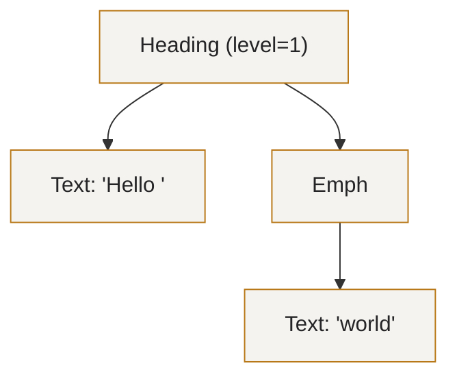
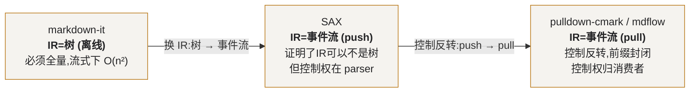
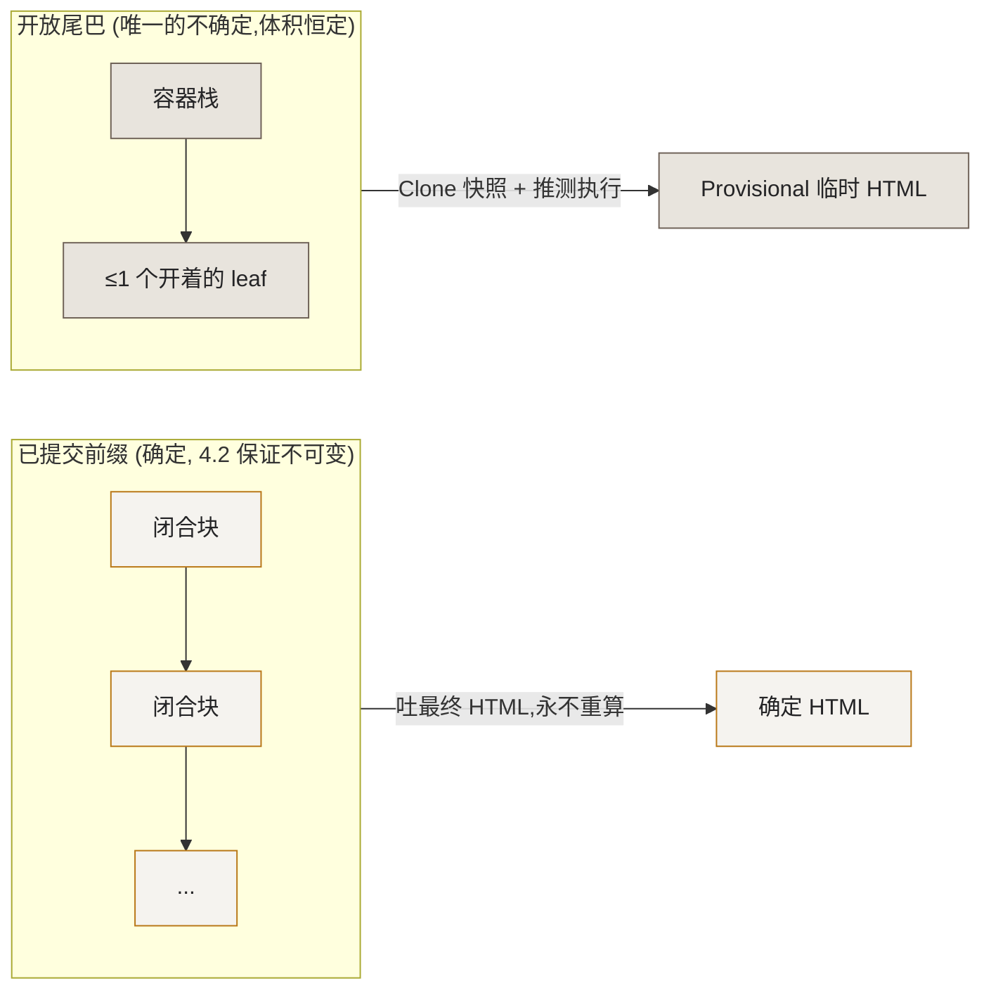
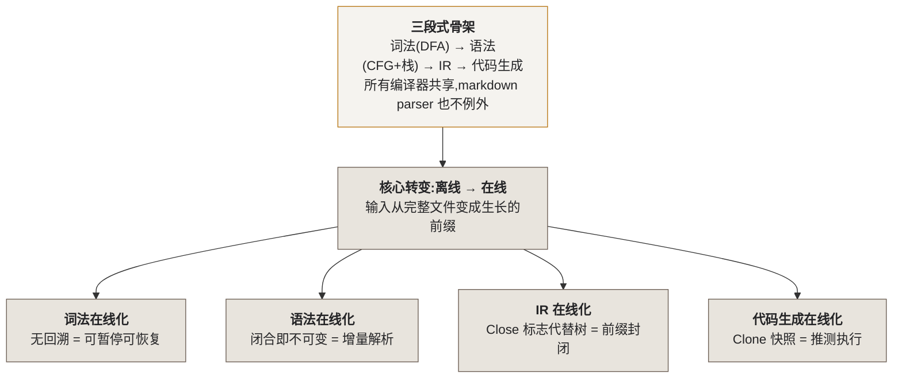

# 从 Markdown Parser 的架构演进，看懂编译原理

> 这不是一篇「mdflow 源码导读」。
>
> 这是一篇**用 Markdown 解析器这个最小可玩的编译器，把编译原理讲明白**的文章。
> Markdown parser 麻雀虽小、五脏俱全：词法、语法、中间表示、代码生成，一个不缺；
> 而它这二十年的架构演进——markdown-it → SAX → pulldown-cmark → 流式增量解析——
> 恰好完整演示了**编译原理里每一个核心概念，在「输入从完整文件变成实时流」之后如何演化**。
>
> 我们会拿本仓库的 `mdflow`（一个 Go 流式 Markdown 解析器）当**解剖标本**，
> 因为它把这些概念都落成了可以点开核对的真实代码。但主角始终是编译原理本身。
>
> 读完你应该掌握的是可迁移的东西：DFA 与词法、CFG 与语法分析、IR 是一个「设计选择」、
> 控制反转、增量解析、推测执行——而不是「mdflow 怎么写的」。
>
> 所有代码片段均来自本仓库或公开源码，可点击文件路径跳转核对。

---

## 全文的一条主线：离线编译 vs 在线编译

先把结论摆在最前面，后面所有内容都挂在这根线上。

打开任何一本编译原理教科书（龙书），它讲的都是**离线编译（offline）**：

> 输入是一个**已经完整躺在磁盘上的文件**。编译器可以任意前后扫描、可以回溯、
> 可以「先读完整个文件再决定第一行是什么意思」。

这个假设如此根深蒂固，以至于大多数人从没意识到它是个**假设**。而 Markdown 解析器的
演进史，就是这个假设被一步步打破的历史——从「等文档写完再解析」，走到「一个字符一个
字符地边到边解析」，最后到 LLM 时代「一个 token 一个 token 地边生成边解析」。

> **中心论点**：编译原理的每一个经典阶段——词法、语法、IR、代码生成——都有一个
> 教科书里的**离线形态**，和一个被流式输入逼出来的**在线（online）形态**。
> Markdown parser 的架构演进，就是这四个阶段逐个「在线化」的过程。
> **看懂这个过程，你就同时看懂了编译原理的经典模型和它的现代变体。**


带着这根线，我们先补齐编译原理的骨架。

---

## 一、编译原理的骨架：每个解析器都逃不掉的三段式

### 1.1 一个编译器由什么构成

无论是 LLVM 编译 C++、TypeScript 编译 TS，还是一个 Markdown 库把 `# Hello` 变成
`<h1>Hello</h1>`，它们的骨架是**同一个**：


- **词法分析（Lexer）**：把字符流切成有意义的**词法单元（token）**。`# Hello` →
  `[HASH, SPACE, WORD("Hello")]`。它回答「这堆字符里，哪些该被看成一个整体」。
- **语法分析（Parser）**：按**文法（grammar）**把 token 组织成有结构的东西。它回答
  「这些 token 之间是什么嵌套/包含关系」。
- **中间表示（IR）**：语法分析的产物。教科书默认它是 **AST（抽象语法树）**，但——
  这是全文最重要的伏笔——**IR 是什么形态，是一个可以选的设计决策**。
- **代码生成（Codegen）**：把 IR 翻译成目标产物。对 Markdown 而言就是 HTML。

Markdown parser 是学编译原理的绝佳标本，正因为它**小到你能一次性看懂全部四段**，
却又**大到四段一个都不少**。下面我们逐段拆，每拆一段都先讲清楚它背后的编译原理概念。

### 1.2 词法分析的理论内核：DFA 与正则语言

词法分析的数学基础是**有限状态自动机（Finite Automaton）**，具体说是 **DFA
（确定性有限自动机）**。这句话听起来吓人，但它的意思朴素得惊人：

> **一个 DFA = 一组状态 + 一张「当前状态 + 当前输入字符 → 下一个状态」的转移表。**
> 词法分析器的本质，就是把源码喂给这样一个状态机，让它在状态之间跳来跳去。

而 DFA 落到代码上，就是那个所有 parser 都长一个样的东西——**一个 for 循环 + 一个
switch**：for 循环逐字符推进，switch 根据「当前状态 + 当前字符」决定怎么转移。

`mdflow` 的行内词法扫描把这个理论内核裸露得很干净
（[parser/inline.go](../parser/inline.go)，只截主循环）：

```go
	for s.pos < len(src) {                      // ← for:逐字符推进
		matched := false
		for _, r := range p.rules[src[s.pos]] { // ← switch:据当前字符查转移
			if r.Match(s) {
				matched = true
				break
			}
		}
		if !matched {
			s.AddByte(src[s.pos])
			s.pos++
		}
	}
```

这里有一个**编译原理的关键性质**，值得停下来讲：`s.pos` **只增不减（无回溯）**。

DFA 有一个理论上的美好性质——它可以做到**单遍、无回溯、O(n)**。一个纯 DFA 读到第 k 个
字符时，永远不需要「退回去重看第 k-3 个字符」。`p.rules[src[s.pos]]` 这个「按当前字符
查规则表」的写法，正是 DFA 转移表的直接体现：**看到 `*` 就转移到「可能是强调」的分支，
看到 `[` 就转移到「可能是链接」的分支**。用「表驱动」代替「一长串 if-else」，既是理论
上的 DFA，也是工程上的可扩展性（加语法 = 往表里加一行）。

> **📌 为什么无回溯这么重要，到第二部分你会震惊**：教科书里无回溯只是「快一点」；
> 但在流式场景下，无回溯是**正确性的生死线**——一个会回溯的 lexer，永远不知道下一个
> chunk 会不会逼它退回去推翻已经产出的 token。记住这个伏笔。

### 1.3 语法分析的理论内核：CFG，以及 Markdown 为什么「不老实」

语法分析的数学基础是**上下文无关文法（Context-Free Grammar, CFG）**。CFG 用一组
产生式描述「合法的嵌套结构」，比如：

```
document  → block*
block     → heading | paragraph | list | blockquote
list      → listItem+
listItem  → block*        ← 注意这里递归了:列表项里又能放块
```

最经典的实现手法叫**递归下降（recursive descent）**：每个非终结符写成一个函数，
`parseList` 内部调用 `parseListItem`，`parseListItem` 又回头调用 `parseBlock`——
文法的递归结构，直接变成函数调用的递归结构。这是编译原理里最优雅的对应之一。

**但这里有一个必须讲透的深度点**：Markdown **并不是一个干净的上下文无关语言**。
这恰恰是它作为教学标本最有价值的地方——它让你看到理论在现实里会怎样「不老实」：

1. **上下文相关（context-sensitive）**：同样是 `-`，在行首是列表项，在别处是普通文本；
   `1.` 在段落里是有序列表，在别的地方不是。一个 token 的含义**依赖它所在的上下文**，
   这已经溢出了「上下文无关」的定义。
2. **歧义（ambiguous）**：`***foo***` 到底是「加粗的斜体」还是「斜体的加粗」？
   CommonMark 不得不用一整套额外规则（左右侧 flanking、分隔符长度配对）去消歧——
   这套规则严格来说已经不属于 CFG 了。

所以真实世界的 Markdown 解析器都不是「纯递归下降」，而是**分成两相**（这也是
CommonMark 官方规范附录 A 的做法，[parser/block.go](../parser/block.go) 直接照做）：

```go
// Every incoming line does three things (phase 1 of CommonMark's appendix A):
//
//	1. matchPrefix    match the existing container prefixes; close what fails
//	2. open           try to open new containers
//	3. classify       hand the remainder to the leaf rules (paragraph catches all)
```

- **第一相：块结构分析**，用一个**容器栈（container stack）**处理嵌套。这不是递归下降，
  而是**显式栈式解析**——因为块结构是逐行、上下文相关的，用栈比用递归更贴合「按行喂入」。
- **第二相：行内分析**，才是 1.2 那个 DFA。

> **📌 编译原理的一课**：教科书给你干净的 CFG 和递归下降，但真实语言几乎总是「基本
> 是 CFG，但有几处上下文相关和歧义」。工程上的解法不是「硬套理论」，而是**分层**：
> 能用 CFG 的部分用 CFG，不能的部分用栈、用额外的消歧规则兜住。**理论是骨架，
> 分层是血肉。**

### 1.4 IR 的理论内核：AST 是一个「选择」，不是一个「必然」

现在到了全文的思想枢纽。

教科书讲到语法分析的产物，几乎都直接说「就是 AST」。以至于绝大多数人把
**「语法分析」和「建一棵树」当成了同义词**。这是一个根深蒂固的误解。

**AST 只是 IR 的一种形态，而 IR 的形态是可以选的。** LLVM 的 IR 不是树，是**线性的
三地址码 + 基本块**；Java 字节码是**线性的栈式指令**。选择什么 IR，取决于「下游想
怎么消费它」——这是编译器设计里**最高层的决策**，因为它同时约束了前端能怎么产出、
后端能怎么消费。

我们先看 AST 长什么样。`# Hello *world*` 建成树是这样：



这棵树很直观。但它有一个**几乎从不被讨论、却在流式场景下致命**的隐含性质，
请务必记住它，它是连接第一部分和第二部分的桥：

> **一棵树必须是完整的，才是合法的。「半棵树」不是一个合法的东西。**

`Emph` 节点必须有它闭合的 `*`，否则它就不该被建成 `Emph`。这在离线编译里毫无问题——
反正文件是完整的，树自然能建完整。但请把这句话存好，第二部分我们就要用它引爆整个论述。

至此，编译原理的骨架补齐了：**词法（DFA）→ 语法（CFG + 栈）→ IR（AST 或别的）→
代码生成**。接下来，我们让输入「动」起来。

---

## 二、当输入变成流：经典模型在哪一刻崩塌

### 2.1 触发这一切的现实：三种流，一种比一种苛刻

「流式输入」不是新东西，但它有**三个代次**，对编译器的挑战逐级加码：

| | 数据是否已存在 | 语法是否保证完整 | 你要对付的不确定性 |
| --- | --- | --- | --- |
| **File IO** | 是，只是分批读 | 是，文件早写好了 | 几乎没有 |
| **Network IO** | 是，只是分批到 | 是 | 字节被切成两半（UTF-8 截断） |
| **LLM token 流** | **否，边生成边到** | **否，任意时刻都可能残缺** | 字节切分 **+** 语法残缺，双重 |

前两种流，语法结构永远是完整的——因为数据源（文件）早就存在。你唯一要担心的是一个
字符被切成两半。**这还在离线编译的舒适区边缘**：大不了缓冲一下，等凑齐再解析。

LLM token 流是**质变**。它的内容**此刻还不存在**，是边生成边吐的。这意味着你拿到的
每一帧，都可能是**语法上真的残缺**：`**` 开了没闭、表格只有表头、围栏 ```` ``` ````
的第二个反引号还没吐出来。**你没法「等凑齐」，因为根本不知道要等多久，而且用户在盯着
屏幕等光标闪。**

这就是 1.4 那个伏笔引爆的时刻：

> LLM 的输出是一个**不断生长的前缀**。而**树要求完整才合法**。
> 于是「用 AST 表示一个正在生成的文档」这件事，**在定义上就是矛盾的**。
> `# Hello *wor` 该建成什么树？你不知道 `*` 后面是不是强调，因为还没看到配对的 `*`。

**这是经典编译模型崩塌的精确位置**：不是词法崩了，不是语法崩了，是**IR 的形态（树）
和输入的形态（生长的前缀）从根本上不兼容**。

### 2.2 破局的钥匙：前缀封闭性（prefix-closed）

既然树不行，我们需要给 IR 提一个新的**理论要求**：

> **前缀封闭性**：一个合法文档的**任意前缀**，用这个 IR 表示出来，也应该是
> **合法的、可用的**。

拿这把尺子去量：

- **树不是前缀封闭的**：`# Hello *wor` 的树是「半棵 Emph 树」，非法。✗
- **线性的 token / 事件流是前缀封闭的**：`Enter(Heading)` → `Text("Hello ")` →
  `Enter(Emph)` → `Text("wor")`——每一个已经吐出的事件都是**已经成立、永不反悔**的
  事实。后面来的内容只会**追加**新事件，绝不推翻旧的。✓

看到了吗？我们被逼着，从「树」这个 IR，换成了「线性事件流」这个 IR。**这不是审美偏好，
是前缀封闭性这条硬要求筛选的结果。** 而这，正是 1.4 埋下的「IR 是一个选择」在流式约束
下给出的答案。

编译原理里有个专门的名字对应这件事——**增量解析（incremental parsing）**：不重建，
只在已有结果上追加/局部更新。前缀封闭的 IR 是增量解析的**前提**：因为旧结果永不反悔，
新输入才只需要「接着长」，而不是「推倒重来」。

### 2.3 这就是 Markdown parser 二十年演进的暗线

现在回头看历史，你会发现 Markdown / 标记语言解析器的每一次架构跃迁，都是在**沿着
「让 IR 更前缀封闭、让解析更在线」的方向爬**——尽管当年的人未必用这套词汇描述它。
下一部分，我们就顺着这条演进线，一个一个把编译原理的概念钉死。

---

## 三、顺着架构演进，逐个击穿编译原理的概念

### 3.1 markdown-it：教科书式离线编译器的巅峰

[markdown-it](https://github.com/markdown-it/markdown-it) 是 JS 生态的主流实现，它是
**1.1 那张三段式图的最忠实的执行者**：词法/语法分析产出一个**完整的 Token 数组**（它的
IR），再统一遍历渲染。它对应龙书里最标准的离线模型。

它奠定的很多范式都是对的、被后人继承的——比如可插拔的规则表 `Ruler`（`mdflow` 的
`RuleSet` 注释直接写着 "modelled on markdown-it's ruler"）、按 token 类型分发的
`renderer.rules`。**这些是编译器工程的通用好设计，与离线/在线无关。**

但它的 IR 是「一次性建好的完整结构」，这让它在流式场景下只有一条路：**每来一个 chunk，
把已收到的全文重新解析一遍**。这是 **O(n²)**，而且是能烧 CPU 的真实 O(n²)。

`mdflow` 的 benchmark 把这个代价拆得很清楚，这个拆解本身极具编译原理的教学价值——
它把「快」诚实地分成了两个正交的来源：

- gomark（另一个**建树**的 Go 库），流式重解析策略：**19.9 ms**
- mdflow **也用**朴素重解析策略：566 µs —— 快了 **19×**，这是**单遍无回溯扫描**的功劳
  （对应 1.2 的 DFA 理论优势，是「代码/算法层」的胜利）；
- mdflow 换成**增量解析**：39.2 µs —— 又快 **18×**，这是**前缀封闭 IR**的功劳
  （对应 2.2 的增量解析理论，是「架构层」的胜利）。

两者相乘 ≈ **346×**。

> **📌 编译原理的一课**：性能有两个正交的来源——**算法**（单遍 vs 建树）和**架构**
> （增量 vs 重建）。前者靠代码功力，后者靠 IR 选型。**后者是花再多功夫写代码也换不来
> 的，因为它是「树」这个 IR 的理论天花板**：树是封闭世界的，天生不支持增量长大。
> 这就是为什么很多 AI 对话产品「越聊到后面越卡」——不是机器不行，是 IR 选错了。

### 3.2 SAX：编译原理最深的一课——IR 的形态可以换

XML 世界很早就撞上「文档太大装不进内存」，于是分裂出两条路：DOM（建整棵树，
=markdown-it 的思路）和 **SAX**（不建树，边扫边回调 `startElement` / `characters` /
`endElement`）。

SAX 的历史功绩，用编译原理的语言说，是**第一次在工业界大规模证明了：语法分析的产物
不一定是树，可以是一个「事件序列」**。它把 1.4 那句抽象的「IR 的形态是可以选的」变成
了活生生的产品。这是通往前缀封闭、通往在线解析的**决定性一步**——你无法在一棵必须
建完整的树上做流式，但你可以在一串事件上做。

**但 SAX 选错了控制权的方向。** 它是**推（push）模型**：控制权在 parser 手里，它不停
往你的 handler 里塞事件。消费者是**被动**的——你说不出「我只要前 3 个标题」，因为
parser 不听你的，它会一路扫到文档末尾。这个缺陷埋得很深，下一节被修正。

### 3.3 pulldown-cmark：控制反转（Inversion of Control）

Rust 的 [pulldown-cmark](https://github.com/pulldown-cmark/pulldown-cmark) 完成了
关键一跃：把 push 翻转成 **pull（拉）**。Parser 本身变成一个 **迭代器（Iterator）**，
消费者想要一个才拉一个：

```rust
for event in Parser::new(markdown) {
    match event { /* ... */ }
}
```

这在编译原理/程序语言理论里是一个有名字的概念——**控制反转**，其实现基础是
**协程 / 生成器（coroutine / generator）**。它的意义远不止「优雅」：

| | push（SAX） | pull（pulldown-cmark） |
| --- | --- | --- |
| 控制权 | 在 parser | **在消费者** |
| 提前终止 | 做不到 | `break` 即停 |
| 背压（backpressure） | 无 | 天然具备 |
| 组合性 | 靠回调嵌套 | **就是个 Iterator，可任意组合** |

`mdflow` 直接采用这个模型，用的是 Go 1.23 的 `iter.Seq[Event]`
（[event.go](../event.go) 注释："in the shape pulldown-cmark popularised"）。这个
函数的文档一句话点破了控制反转的灵魂（[events.go](../events.go)）：

```go
// Events returns the unified pull event stream with the Parser's middleware
// chain applied. Ranging over it drives the parser; breaking out of the range
// stops parsing immediately — the document is never fully materialised.
func (p *Parser) Events(src string) iter.Seq[Event] {
	raw := p.rawEvents(src)
	if p.chain == nil {
		return raw
	}
	return p.chain(raw)
}
```

**"Ranging over it drives the parser; breaking out stops parsing immediately"**——
是消费者的 `for range` 在**驱动** parser，消费者一 `break`，parser 就停在那个字节，
绝不多扫一个。**控制权彻底交给了消费者。** 这就是控制反转落到代码上的样子。

### 3.4 演进到此的全景



一句话串起来：**这二十年，Markdown parser 干的事就是「把 IR 从树换成前缀封闭的事件流，
再把控制权从 parser 交还给消费者」——这正是编译原理从离线走向在线的两个核心动作。**

---

## 四、深水区：四个经典阶段如何逐个「在线化」

前面讲了「为什么要在线化」。这一部分讲「每个阶段具体怎么在线化」——这是全文最硬核、
也最能体现编译原理深度的地方。我们对着 1.1 那四段，逐段看它的在线形态。

### 4.1 词法在线化：无回溯，是「可暂停可恢复」的前提

回到 1.2 那个「`s.pos` 只增不减」。在离线编译里，无回溯只是个性能优化。**在线化之后，
它升级成了正确性的地基**：

> 一个 DFA 只有在**无回溯**时，才能在**任意字节边界暂停、之后无缝恢复**。
> 因为「暂停点之前的所有决定都已定案、永不反悔」，恢复时只需从暂停的状态继续转移。

这正是 2.1 那个 LLM 流的核心诉求。一个会回溯的解析器（很多正则驱动的实现就是）在
流式下是灾难：你永远不知道下一个 chunk 会不会让它回头，推翻已经产出、甚至已经上屏的
东西。**「for + switch 且游标只进不退」，就是词法阶段在线化的全部秘密。**

### 4.2 语法在线化：「闭合即不可变」= 增量解析的落地

2.2 说增量解析需要「旧结果永不反悔」。这个抽象要求，在语法阶段落成了一条**硬不变式**。
看 [parser/block.go](../parser/block.go) 开篇：

```go
// The entire state is small enough to draw on a napkin, and that is precisely
// what makes streaming work: a closed block is never re-parsed, so appending
// input only ever touches the top of the stack. Incremental cost is O(new lines),
// not O(document).
```

**"a closed block is never re-parsed"**——一个块一旦闭合，就变成不可变的历史。这句话
就是「前缀封闭」在语法阶段的化身。它带来一个漂亮的结论：因为只有**栈顶**可能变，喂新
内容只碰栈顶，**增量成本是 O(新增行数)，不是 O(整篇文档)**。3.1 那个白拿的 18×，
理论根源就在这一行注释里。

这也解释了 1.3 为什么块结构要用**显式栈**而不是递归下降：栈可以「保留在两次输入之间」，
下一行来了接着往栈顶操作即可；而递归下降的调用栈会随函数返回而销毁，天然不适合
「解析到一半停下来等下一行」。**在线化，反过来影响了语法分析算法的选型。**

### 4.3 IR 在线化：把「配对」从树的边，降维成流里的两个独立事实

这是 IR 阶段在线化的精髓。2.2 说要用「线性事件流」代替树，但**怎么在一条线性流里表达
「谁包含谁」**？树用父子边表达包含，流里没有边，怎么办？

`mdflow` 的词汇表包**故意不叫 `ast`，因为它里面没有树**
（[token/token.go](../token/token.go)）：

```go
// It is deliberately not called "ast" and deliberately holds no tree. An
// [Inline] carries a Close flag rather than children, so a document is a linear
// token stream that can be emitted and rendered in one pass — the representation
// a syntax tree would replace, not a step toward one.
```

答案是一个 `Close` 标志。`*world*` 不再是「Emph 节点挂一个 Text 子节点」，而是**三个
平铺的 token**：`Emph(Close=false)` → `Text("world")` → `Emph(Close=true)`。

```go
type Inline struct {
	Text  string // literal content of Text / CodeSpan
	Dest  string // target URL of a Link / Image open token
	Title string // optional title attribute of a link/image
	Node  Node
	Tag   Tag  // Custom discriminator; the renderer dispatches on it
	Close bool // paired nodes: false=open, true=close; leaf tokens always false
}
```

**这一步在编译原理上的意义**：它把「包含关系」从**树的结构性属性（父子边）**，降维成了
**流里的两个独立事件（一个 open、一个 close）**。为什么这是在线化的关键？因为

> **一条边，必须两端都在场才成立；而两个独立的事实，可以一个一个先后到达。**

`Emph(open) → Text("wor")` 是一个合法前缀——「一个开着的强调，里面目前有 wor」。
而「半棵 Emph 树」什么都不是。**Close 标志就是让 IR 变得前缀封闭的那个具体机关。**
顺带地，没有 children 切片就没有每节点的堆分配——这是 mdflow 比 gomark 少分配
113×~8122× 对象的直接原因之一，但那是副产品，不是目的。

还有一个承接 1.2「用整数承载语义」的小技巧：Node 枚举**故意排序**，块级节点全排在
`Text` 之前，于是「是不是块级」退化成一次整数比较：

```go
// IsBlock reports whether the event's node is a block-level node.
func (e Event) IsBlock() bool { return e.Node < token.Text }
```

### 4.4 代码生成在线化：推测执行（Speculative Execution）

最后一段，也是最烧脑的一段。前三段解决了「如何前缀封闭地表示已确定的部分」。但 2.1
那个 `**加粗` 的灵魂拷问还没答：**一段还没闭合的强调，在它闭合之前，到底该渲染成什么？**

你有三个选择，**三个都是错的**：

- **A. 把 `**` 当普通文本渲染**：万一下一个 token 让它闭合了，它其实是加粗，你渲染错了，
  还得把已上屏的 `**` 擦掉重画——闪烁。
- **B. 乐观地当加粗，渲染 `<strong>`**：万一到段落结束都没等到第二个 `**`，它压根不是
  加粗，又错了。
- **C. 等它闭合了再渲染**：光标不闪了，但退回 markdown-it 的 O(n²) 老路，产品体验崩。

编译原理/计算机体系结构里，对付这种「必须在信息不全时先往下走」的情形，有一个成熟的
思想——**推测执行**：**先按一个猜测往下算，同时保留「猜错了能回滚」的能力，且推测的
结果绝不污染已确定的状态。** CPU 用它做分支预测，编译器用它做投机优化。`mdflow` 把它
用在了代码生成阶段。

关键机关是 `Clone()`——对「不确定的那一小块」做一份**廉价快照**，在快照上推测，
猜错了整份丢掉即可（[parser/block.go](../parser/block.go)）：

```go
func (s *BlockState) Clone() *BlockState {
	out := &BlockState{rules: s.rules, seq: s.seq}
	out.stack = append([]container(nil), s.stack...)
	if s.leaf != nil {
		out.leafStore = *s.leaf // copies scratch shallowly, which is the contract
		out.leafStore.lines = append([]string(nil), s.leaf.lines...)
		// Scratch is written once at open and only read afterwards, so sharing it
		// is safe. A scratch that holds mutable state opts into a deep copy.
		if cs, ok := s.leaf.scratch.(interface{ CloneScratch() any }); ok {
			out.leafStore.scratch = cs.CloneScratch()
		}
		out.leaf = &out.leafStore
	}
	return out
}
```

**这份快照为什么能廉价？** 因为 4.2 的「闭合即不可变」保证了：不确定性**只存在于栈顶
那一小块**（容器栈 + 至多一个开着的 leaf）。已提交的部分是确定历史，根本不用进快照。
于是快照成本恒定，与文档多长无关。**这就是「把不确定性关进一个体积恒定的小笼子」——
推测执行的代价被压到了最小。**

对表格这种「多行才成型」的构造，推测还要更进一步：在快照上「假装它已经结束」跑一遍
finaliser，好让用户看到一个**结构完整的临时表格**，而真实解析在原件上继续等 body 行
（[parser/block.go](../parser/block.go)）：

```go
	if fn := s.rules.finalisers[s.leaf.tag]; fn != nil {
		// A multi-event leaf has no half-open projection: finalise a snapshot so
		// the caller sees the whole construct (a header-only table, say) while the
		// real parse keeps accumulating.
		snap := s.Clone()
		lf := snap.leaf
		snap.leaf = nil
		fn(snap, lf.lines, lf.scratch)
		return containers, nil, snap.events
	}
```

于是流式渲染的全貌是：**已提交前缀**吐最终 HTML（确定、永不重算），**开放尾巴**在
快照上推测出一个 Provisional 临时视图。两者一拼，就是不闪、不卡、不错的流式上屏。
2.1 那个「三个选择都是错的」困境，被第四条路——推测执行——解掉了。



### 4.5 IR pass：编译器的「中端」，在流式下长成了洋葱圈

编译原理里，前端和后端之间还有一层**中端**——在 IR 上做一遍遍变换（optimization
pass），每个 pass 都是「IR 进、IR 出」。LLVM 的 pass manager 就是把几十个这样的 pass
串起来。

当 IR 是前缀封闭的事件流时，这个「IR pass」长成了极其自然的形态——一个
`流 → 流` 的函数（[parser.go](../parser.go)）：

```go
type Middleware func(iter.Seq[Event]) iter.Seq[Event]
```

它和 LLVM 的 pass 是**同一个概念**：都是「消费一个 IR，产出一个 IR」，因而可以像洋葱皮
一样任意堆叠。这就直接支撑了「同一个 parser、多套输出策略」的真实需求——比如同一篇
文档，Web 端给外链加 `nofollow`、邮件端去掉 `` 留 alt、审计端抽出所有链接：

```go
var base = mdflow.New()
var forEmail = base.
    Transform(mdflow.Unwrap(mdflow.IsImage)).   // pass 1:去图片留 alt
    Transform(mdflow.RewriteLinks(track))        // pass 2:改写链接
var forWeb = base.WithExtensions(nofollowLinks)  // 另一条 pass 链
// base 本身丝毫未变——每条 pass 链互不污染
```

**但在流式 IR 上写 pass，有一个树上没有的代价，这才是值得深挖的编译原理点。** 在树上，
「删除所有图片」是 `node.children = filter(...)`，结构安全由树天然保证。但在 4.3 那个
**扁平流**上，你不能简单 `Filter(IsImage)`——因为一个节点是**两个独立事件**，只过滤掉
一半会让 open/close 失配，产出坏掉的 markup。所以必须自己用一个 `depth` 计数器，
把被降维掉的「结构性」重新数回来（[transform.go](../transform.go)）：

```go
// Drop removes whole nodes — the EnterEvent, the LeaveEvent and everything between —
// so the output stays balanced. Filtering on the same predicate would emit one
// half of the pair and corrupt the markup.
func Drop(pred func(Event) bool) Middleware {
	return func(seq iter.Seq[Event]) iter.Seq[Event] {
		return func(yield func(Event) bool) {
			depth := 0
			for e := range seq {
				if depth > 0 {
					if pred(e) {
						if e.Type == EnterEvent {
							depth++
						} else if e.Type == LeaveEvent {
							depth--
						}
					}
					continue
				}
				if pred(e) && e.Type == EnterEvent {
					if !e.IsAtomic() {
						depth = 1 // skip until the matching LeaveEvent
					}
					continue
				}
				if !yield(e) {
					return
				}
			}
		}
	}
}
```

> **📌 编译原理的一课：没有免费的 IR。** 树把「结构性」免费给你，但不给你前缀封闭；
> 流把「前缀封闭」免费给你，但要你自己用 `depth` 维护结构性。**IR 选型永远是一组
> 权衡的打包出售**，你选了它的优点，就得接住它的代价。成熟工程的标志，是**认清代价、
> 把它一次性写对、藏进库里**（`Drop`/`Unwrap` 就是干这个的），而不是假装它不存在。

---

## 五、性能：解析器/编译器的通用优化律

这一部分讲的不是「mdflow 的奇技淫巧」，而是**编译器与解析器领域的通用工程律**。
一个有力的旁证是：文末附的 **htmlparser2**（纯 JS，benchmark 里打赢了 C 绑定的
libxmljs、比规范完备的 parse5 快约 4.5 倍）用的是**几乎同一套心法**——跨语言的一致性，
恰恰说明这些是**原理层面的规律**，不是某语言的偏方。

### 5.1 词法层：把「匹配」降维成「整数运算」

词法分析是最热的一段，它的优化母题是**别在字符上做重活，把一切压到整数上**。

**A. 用枚举的序关系承载语义**：`IsBlock` 就是 `e.Node < token.Text`（见 4.3），
一次整数比较解决「是不是块级」。
> htmlparser2 更极端：`CharCodes.Lt = 0x3c` 是 TS 的 `const enum`，编译期直接内联成
> 字面量 `60`，运行时就是 `if (c === 60)`，连属性读取都没有。大小写不敏感匹配用
> `(c | 0x20)` 一条指令转小写、不产生新字符串。**同源：让语义落在整数上。**

**B. 2 的幂取模 → 位与**：带 `context` 的路径每 1024 行才查一次取消信号，
`n % 1024` 写成 `n & 1023`（[context.go](../context.go)）：

```go
	if n&(ctxCheckLines-1) == 0 {   // 等价 n % 1024 == 0,但省掉除法指令
		if err := ctx.Err(); err != nil {
			cerr = err
			return false
		}
	}
```

**C. First-set 剪枝——词法优化里最经典的一招**。编译原理里有个概念叫 **FIRST 集**：
一个构造可能由哪些首字符开启。`mdflow` 把它做成一张 `[256]bool` 位图，解析前先 O(n)
扫一遍问「这段里有没有任何可能开启行内构造的字符」，没有就**整段当纯文本、零拷贝返回**
（[parser/inline.go](../parser/inline.go)）：

```go
	if !p.hasTrigger(src) {
		if src == "" {
			return nil
		}
		return []token.Inline{{Node: token.Text, Text: src}}  // Text: src 是别名,零拷贝
	}
```

真实语料里绝大多数句子是纯散文，这条快路径命中率极高——README 里「markup-light
prose」比 gomark 快 **1160×** 主要靠它。
> htmlparser2 的对应物是 `fastForwardTo`：文本态直接 `charCodeAt` 扫到下一个 `<`，
> 中间字符一个都不进状态机。**思路一致：用 FIRST 集判断「这段根本没有我关心的东西」，
> 然后整段跳过，别让每个字节都过一遍完整的转移逻辑。**

### 5.2 内存层：近零分配

编译器处理大输入时，GC / 分配往往比计算更容易成为瓶颈。通用律是**复用缓冲区、
延迟切分**。

**A. 复用单个 leaf 槽 + 单个事件 backing array**。因为 4.2 保证「整篇最多一个开着的
leaf」，所以只需一个槽；`FeedLine` 返回的事件切片也复用同一数组
（[parser/block.go](../parser/block.go)）：

```go
// The returned slice reuses one backing array: the caller must consume it before
// the next feedLine/closeAll. Every driver in this package does exactly that,
// which buys us zero allocations per line.
```

**B. 延迟切分（近零拷贝）**——这是 htmlparser2 的架构级杀手锏，也是通用律：
> htmlparser2 的内部回调签名全是 `(start, end)` **两个数字**，tokenizer **一个字符串
> 都不切**，只维护游标，切片延迟到 Parser 层、且只在你真需要那段内容时才做。对比
> SAX 每个 token 都 `new String`，几万 token = 几万次分配。`mdflow` 走等价思路：
> `hasTrigger` 命中时 `Text: src` 直接别名，行内中间表示 `inlineItem` 用值切片 +
> `sync.Pool` 跨 leaf 回收。

**C. 流式绝不做字符串拼接**。最容易踩的坑是 `buffer += chunk`——那是 O(n²) 内存复制。
htmlparser2 的范本做法是丢掉旧 chunk、用全局 `offset` 记绝对位置、`index - offset`
换算局部下标，于是内存只跟单个 chunk 有关、与文档总长无关。`mdflow` 等价地只在
`pending` 留「最后一个换行后的半行」，遇 `\n` 就整行喂入、`pending.Reset()`。

### 5.3 并行的边界：embarrassingly parallel 不等于「切得越细越好」

编译原理告诉我们 CommonMark 的两相有不同的依赖：块结构严格串行，但**每个已闭合 leaf
的行内解析互不依赖**——是 embarrassingly parallel。直觉上最优雅的做法是「一个 block
开一个 goroutine」。**实测：它比单核还慢一个数量级。** 看 [parallel.go](../parallel.go)：

```go
// Granularity is the whole game. Handing each block to a worker — one goroutine
// hop per block — costs more in scheduler traffic than a block's few
// microseconds of work; measured that way, the fan-out runs an order of
// magnitude *slower* than staying on one core. This implementation therefore
// partitions the block-event stream into a handful of large contiguous ranges,
// one per worker, so a single handoff amortises over thousands of blocks.
```

**一个 block 的活儿只有几微秒，一次 goroutine 调度的开销比它还大。** 正确做法反直觉：
不是切得越细越好，而是把事件流切成「一个 worker 一大段连续区间」，让一次调度开销摊薄
到几千个 block 上。

> **📌 编译原理/并行的一课**：「理论上可并行」和「并行了会更快」是两回事，中间隔着一个
> **粒度（granularity）**。任务粒度必须远大于调度开销，并行才划算。细粒度并行在教科书
> 里很美，在真实调度器上常常是负优化。

### 5.4 诚实的伤疤：连它也有一处 O(n²)

一个只报喜的性能分享不可信。`mdflow` 号称「单遍、近零分配」，但 4.4 那个消歧问题
（1.3 说过 Markdown 的强调是有歧义的）在实现上留下了一处**明显违背原则的疤**——行内
强调配对的第二趟（[parser/inline.go](../parser/inline.go) 的 `processEmphasis`，
这里截配对成功后的重建逻辑）：

```go
			// Flat: bracket the span with an open and a close token instead of
			// collecting the middle into Children.
			rebuilt := make([]inlineItem, 0, len(items)+2)  // ← 每配对一次,重建整个切片
			rebuilt = append(rebuilt, items[:oi]...)
			if items[oi].delim.length > 0 {
				rebuilt = append(rebuilt, items[oi])
			}
			rebuilt = append(rebuilt, inlineItem{tok: token.Inline{Node: node}})
			rebuilt = append(rebuilt, items[oi+1:ci]...)
			rebuilt = append(rebuilt, inlineItem{tok: token.Inline{Node: node, Close: true}})
			if items[ci].delim.length > 0 {
				rebuilt = append(rebuilt, items[ci])
			}
			rebuilt = append(rebuilt, items[ci+1:]...)
			items = rebuilt
```

每配对成功一次就 `make` 一个新切片、全量拷贝。配对 D 对分隔符，最坏是 O(n·D) 时间 +
D 次分配。**这是整个库里最不「mdflow」的一段。** 为什么可以接受？三个诚实的理由：

1. **FIRST 集快路径（5.1C）让绝大多数文本压根到不了这一趟**——纯散文早返回了；
2. 真实文本里 `*`/`_` 很少，D 通常是个位数，O(n·D) 退化成近似 O(n)；
3. CommonMark 的消歧规则本身就复杂（1.3 提过），把它写成就地零拷贝会显著牺牲可读性——
   **在一个冷路径上用可读性换极致性能，是笔亏本买卖。**

> **📌 编译原理的一课**：优化的判断力，一半是「哪里该优化到极致」，另一半是「哪里
> **不值得**」。在热路径（词法扫描、分配）上锱铢必较，却在这个冷路径上从容留一个
> O(n·D)——**有所为有所不为，比无脑优化每一行更能体现工程成熟度。**

### 5.5 最大的一笔优化：战略性地「不做完整的规范」

这是最重要、也最反直觉的一条。htmlparser2 的 README 第一句就写着：

> *htmlparser2 is the fastest HTML parser, and takes some shortcuts to get there.
> If you need strict HTML spec compliance, have a look at parse5.*

它放弃了完整的 HTML5 tree construction（insertion modes、adoption agency
algorithm、foster parenting……），用约 4.5× 的速度换掉「你大概率不需要的规范严格性」。
`mdflow` 做了同样的取舍：它是 **CommonMark 的子集**，缩进代码块、引用式链接、HTML 块、
脚注一律不做——但通过公开 API 可注册规则补上，且用 `TestCommonMarkConformance` 给
合规率上了**回归下限**，保证只能往上走。

> **📌 编译原理的一课**：**「完整实现语言规范」和「快」经常是对立的**，取舍的判据永远
> 是**场景**。LLM 流式渲染、UGC、feed/模板处理，用不上 adoption agency algorithm；
> 但你要做 jsdom、做逐字节对齐浏览器的安全 sanitizer、处理恶意畸形 HTML——那就该用
> parse5，它慢的那 7ms 买的是**正确性**。**脱离场景谈快慢是耍流氓。**

### 5.6 通用优化律速查表

| 优化律（原理） | mdflow | htmlparser2 |
| --- | --- | --- |
| 语义落在整数上 | `Node < token.Text` 枚举序 | `const enum` 内联字面量 |
| 位运算代替算术/字符串 | `n & (ctxCheckLines-1)` | `(c \| 0x20)` 转小写 |
| FIRST 集剪枝 + 快路径 | `hasTrigger` 位图,命中零拷贝 | `fastForwardTo` 批量跳过 |
| 复用缓冲 + 延迟切分 | 单 leaf 槽 + `sync.Pool` | 回调只传 `(start,end)` |
| 流式绝不拼接 | `pending` 半行 / 逐行喂 | `offset` + `index-offset` |
| 并行看粒度 | 一 worker 一大段区间 | —— |
| 战略性放弃规范 | CommonMark 子集 + 回归下限 | 放弃 HTML5 tree construction |

---

## 六、总结：你到底学到了哪些编译原理

回到开篇那根线，把全文收成一张图——它同时也是一张**编译原理概念地图**：



把这些编译原理概念，用一句话各自钉死：

- **三段式**是所有编译器的通用骨架，Markdown parser 让你在一个小系统里看全它。
- **DFA / 无回溯**：词法就是「for + switch」的状态机；无回溯在离线是优化，在线是生死线。
- **CFG 的局限**：真实语言（Markdown）几乎总是「基本是 CFG，但有上下文相关和歧义」，
  工程解法是**分层**，而不是硬套理论。
- **IR 是一个设计选择**（全文最深的一课）：AST 只是 IR 的一种；当输入是流，
  **前缀封闭**这条要求会把你从「树」逼到「线性事件流」。
- **控制反转**：push（SAX）→ pull（迭代器）把控制权交还消费者，是在线解析的另一半。
- **增量解析 / 推测执行**：这两个听起来高深的概念，在流式 Markdown 里分别落成了
  「闭合块永不重解析」和「在快照上试渲染」两段朴素代码。
- **优化律**：整数化、FIRST 集剪枝、近零分配、并行粒度、战略性放弃规范——是编译器/解析器
  领域跨语言通用的工程规律（htmlparser2 跨语言印证）。

而贯穿这一切的**一句话**：

> **编译原理的经典模型，默认你在编译一个「已经写完的文件」。
> 当输入变成一个「正在被生成的前缀」——无论它来自网络还是来自 LLM——
> 每一个经典阶段都得长出它的「在线」形态。Markdown parser 的架构演进，
> 就是这场「从离线到在线」的迁徙最完整、最可读的一份活标本。
> 看懂它，你看懂的不是一个库，是编译原理的过去与现在。**

---

### 附：延伸阅读（本仓库内，按编译原理阶段索引）

- 骨架与 benchmark：[README.md](../README.md) · 包级设计叙述：[doc.go](../doc.go)
- 词法（DFA / for+switch / FIRST 集）：[parser/inline.go](../parser/inline.go)
- 语法（容器栈 / 闭合即不可变 / 增量）：[parser/block.go](../parser/block.go)
- IR（Close 标志代替树 / 前缀封闭）：[token/token.go](../token/token.go) · [event.go](../event.go)
- 控制反转（pull 事件流）：[events.go](../events.go)
- 代码生成在线化（推测执行 / Provisional）：[stream.go](../stream.go)
- IR pass（洋葱中间件 / 扁平流的代价）：[transform.go](../transform.go) · [parser.go](../parser.go)
- 并行的粒度：[parallel.go](../parallel.go)
- 扩展 seam（树外实现多行多事件块）：[extension/table/table.go](../extension/table/table.go)
